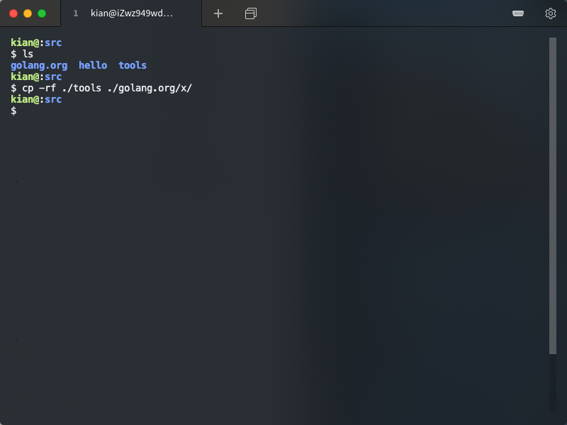
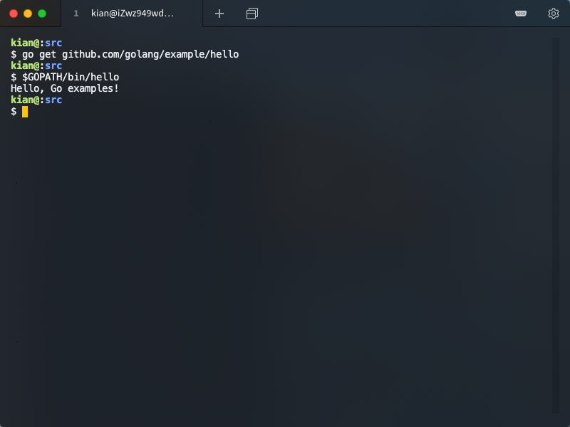

# Ubuntu 配置 go 环境教程

> 壹八叁肆贰零贰壹 Guo Jin

### 环境说明

（在 Mac OS 上连接阿里云服务器）

操作系统：Ubuntu 18.04.4 LTS (GNU/Linux 4.15.0-96-generic x86_64)

已有工具：vim，git

## 安装 golang

安装命令

```shell
sudo apt-get install golang
```


安装完成


测试安装版本

```shell
go version
```


创建工作空间

```shell
mkdir $HOME/gowork
```


配置环境变量

使用 vim 打开 ～/.profile

```shell
vim ~/.profile
```


加载环境变量

```shell
source $HOME/.profile
```


检查配置

```shell
go env
```


## 创建 Hello, world!

创建 hello 目录

```shell
mkdir $GOPATH/src/hello -p
```


编辑 hello.go 源代码

```shell
vim hello.go
```


在终端运行

```shell
go run hello.go
```


## 安装必要的工具和插件

利用 Git 从 GitHub 上下载 go 相关工具源代码（库比较大，建议使用科学上网）

```shell
git clone https://github.com/golang/tools
```


拷贝到目的目录

```shell
mkdir ./golang.org/x/ -p
cp -rf ./tools ./golang.org/x/
```



安装工具包

```shell
go install golang.org/x/tools/go/buildutil
```


用 go 工具构建安装 hello

```shell
go install hello
```


运行 hello


## 安装运行 go tour

下载源码

```shell
go get github.com/Go-zh/tour/gotour
```


但是没有成功

```shell
gotour
```


我尝试了从 GitHub 的 [其他来源](https://github.com/minux/go-tour-zh) 中下载 go tour，但是不尽人意

```shell
go get github.com/minux/go-tour-zh/gotour
```


## 自己的第一个包与测试

创建文件夹 stringutil

```shell
mkdir -p $GOPATH/src/github.com/KianKw/stringutil
```


编辑 reverse.go 文件

```shell
vim $GOPATH/src/github.com/KianKw/stringutil/reverse.go
```


go build 进行编译

```shell
go build github.com/KianKw/stringutil
```


编写新的依赖自己的包的 hello.go

```shell
vim github.com/KianKw/hello/hello.go
```


运行新的 hello.go

```shell
go install github.com/KianKw/hello
hello
```


## 其他附加内容

### 学习使用测试

编写测试文件

```shell
vim github.com/KianKw/stringutil/reverse_test.go
```


go test 运行测试

```shell
go test github.com/Kiankw/stringutil
```


### 学习利用远程包

从远程端下载安装 hello

```shell
go get github.com/golang/example/hello
```



## 小结

go 程序的三种基本方法

* go run [go 文件]
* go install [go 文件的目录] （会将可执行文件放在 bin 文件夹里）
* go get [远程连接]（会将可执行文件放在 bin 文件夹里）

配置环境过程总的来说是比较顺利的，其中出现的小问题有

* 下载 go 相关工具源代码 tools 库时，库比较大，连接易中断。尝试两次不成功后，采用科学上网，成功下载下来整个库。
* 安装 go tour 时，遇到较多问题
  * 课程网页提供的教程不成功后，阅读了 gotour/main.go 文件，发现该文件只是简单的打印一串字符串，并没有理想中的功能。（时间为 2020-09-12，代码来源为 [Go-zh tour/gotour](https://github.com/Go-zh/tour/tree/master/gotour) )。
  * 心想源代码被改，只要找到源代码就可以正常安装。在 GitHub 中搜索 go tour 后，找到了一个看起来不错的 [minux go-tour-zh](https://github.com/minux/go-tour-zh) ，但是下载下来后，依旧不成功。
  * 在网上寻找 go tour 安装教程，发现一篇成熟的 [CSDN blog](https://blog.csdn.net/zhijiayang/article/details/48241443) 。（但是我没有安装成功，[mikespook go-tour-zh](https://bitbucket.org/mikespook/go-tour-zh) 已经消失不见）。
  * 最后，我放弃了安装 go tour 。我认为整个过程已经初步了解 go 的使用方法。之后可以使用在线版的 go tour，没必要非安装下来。

