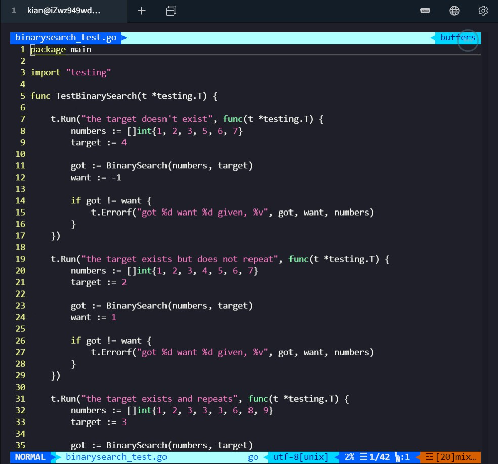
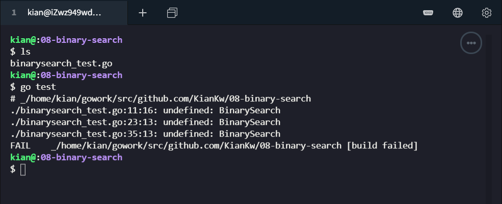
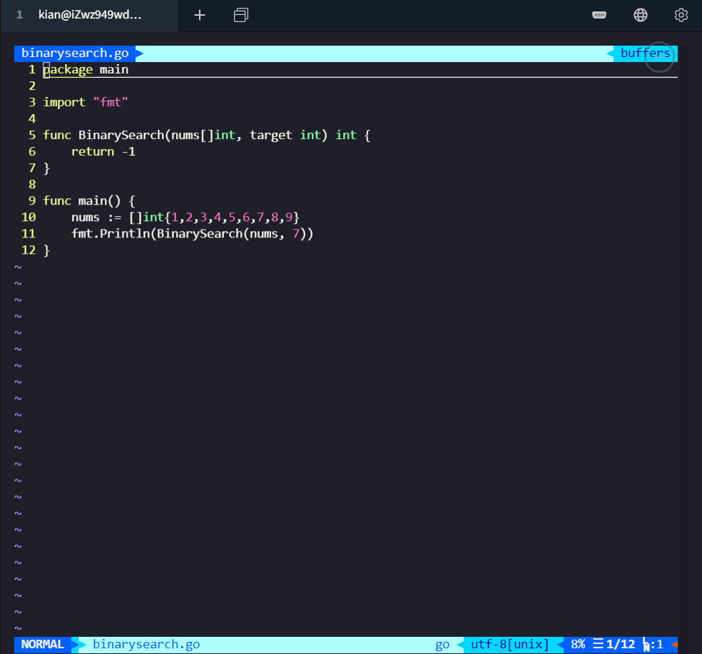
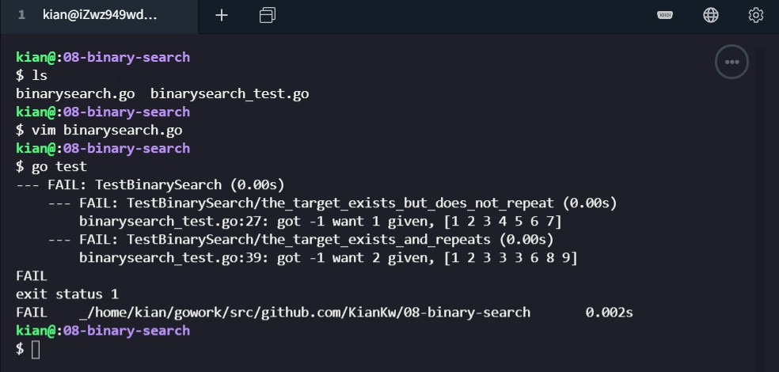
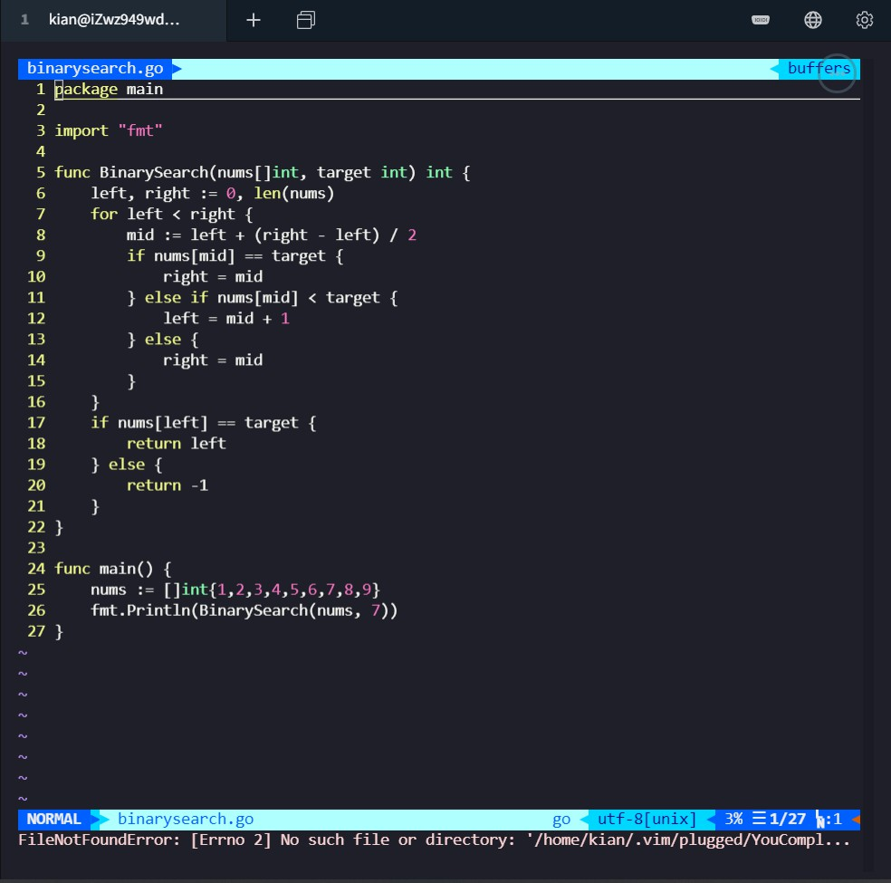
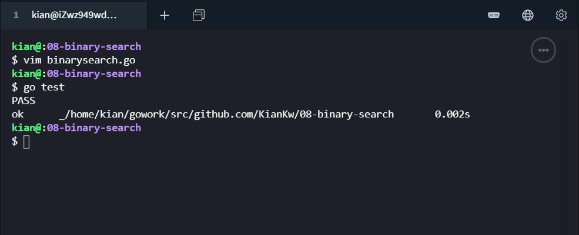
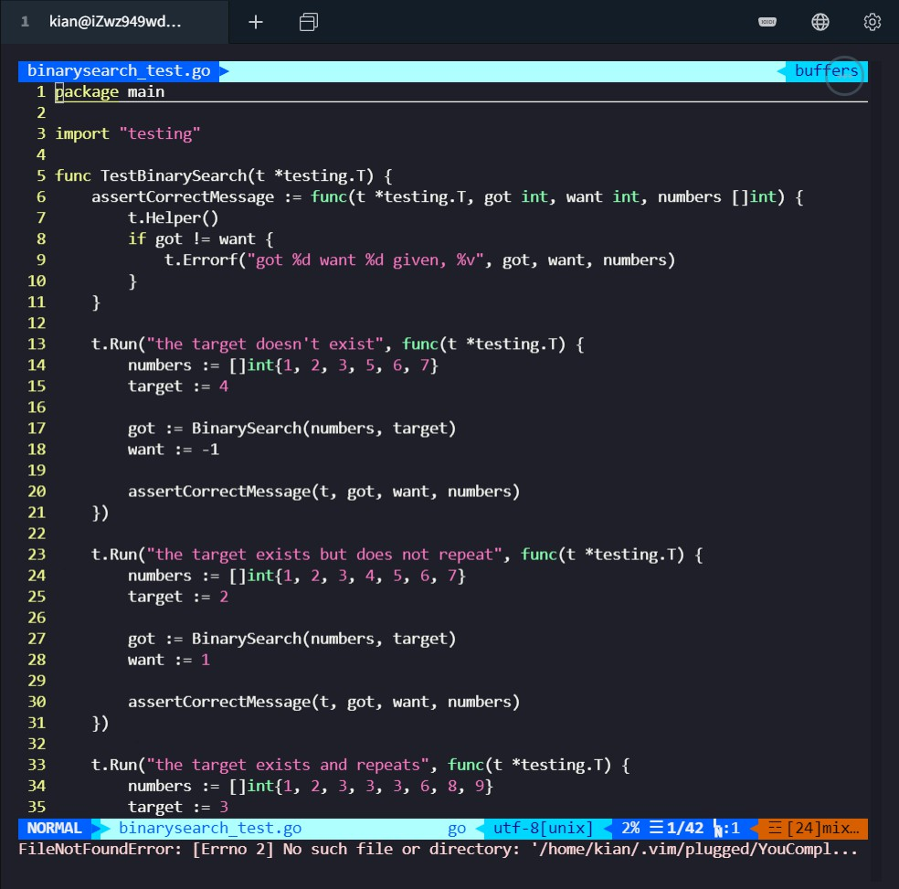
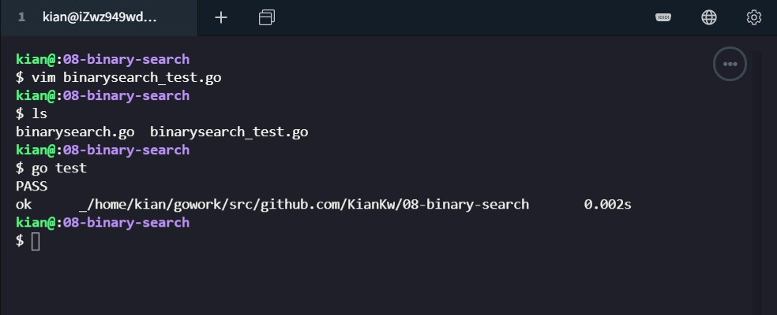

# TDD 实践报告 - 二分查找

> 壹八叁肆贰零贰壹 - Guo Jin - 服务计算课程作业


### 环境说明

（阿里云服务器）

操作系统：`Ubuntu 18.04.4 LTS (GNU/Linux 4.15.0-96-generic x86_64)`

编辑器：`vim`

编译工具：`go version go1.10.4 linux/amd64` 


### 先写测试函数

本次实践要完成稳定的二分查找，如果在数组中存在多个目标值，则返回第一次出现的坐标

在  `binarysearch_test.go` 中：

```GO
func TestBinarySearch(t *testing.T) {

    t.Run("the target doesn't exist", func(t *testing.T) {
        numbers := []int{1, 2, 3, 5, 6, 7}
        target := 4
        
        got := BinarySearch(numbers, target)
        want := -1

        if got != want {
            t.Errorf("got %d want %d given, %v", got, want, numbers)
        }
    })

    t.Run("the target exists but does not repeat", func(t *testing.T) {
        numbers := []int{1, 2, 3, 4, 5, 6, 7}
        target := 2

        got := BinarySearch(numbers, target)
        want := 1

        if got != want {
            t.Errorf("got %d want %d given, %v", got, want, numbers)
        }
    })
    
    t.Run("the target exists and repeats", func(t *testing.T) {
        numbers := []int{1, 2, 3, 3, 3, 6, 8, 9}
        target := 3

        got := BinarySearch(numbers, target)
        want := 2

        if got != want {
            t.Errorf("got %d want %d given, %v", got, want, numbers)
        }
    })

}
```




### 运行测试

使用 `go test` 运行测试将会报编译时错误：`./binarysearch_test ...: undefined: BinarySearch`。

```shell
go test
```




### 先使用最少的代码来让失败的测试先跑起来

```shell
vim binarysearch.go
```



这时测试还会失败，不过会返回明确的错误信息：`binarysearch_test.go:27: got -1 want 1 given, [1 2 3 4 5 6 7]`

```shell
go test
```




### 把代码补充完整，使得它能够通过测试

采用 `len()` 函数来获得数组长度，完善稳定的二分查找算法

```shell
vim binarysearch.go
```



```go
package main                                                                   

import "fmt"

func BinarySearch(nums[]int, target int) int {
    left, right := 0, len(nums)
    for left < right {
        mid := left + (right - left) / 2
        if nums[mid] == target {
            right = mid
        } else if nums[mid] < target {
            left = mid + 1
        } else {
            right = mid
        }
    }
    if nums[left] == target {
        return left
    } else {
        return -1
    }
}

func main() {
    nums := []int{1,2,3,4,5,6,7,8,9}
    fmt.Println(BinarySearch(nums, 7))
}
```


成功通过测试

```shell
go test
```




### 重构

优化测试代码，减少代码冗余度

```shell
vim binarysearch_test.go
```



```go
package main                                                                    
import "testing"

func TestBinarySearch(t *testing.T) {
    assertCorrectMessage := func(t *testing.T, got int, want int, numbers []int) {
         t.Helper()
        if got != want {
            t.Errorf("got %d want %d given, %v", got, want, numbers)
        }
    }

    t.Run("the target doesn't exist", func(t *testing.T) {
        numbers := []int{1, 2, 3, 5, 6, 7}
        target := 4

        got := BinarySearch(numbers, target)
        want := -1

        assertCorrectMessage(t, got, want, numbers)
    })

    t.Run("the target exists but does not repeat", func(t *testing.T) {
        numbers := []int{1, 2, 3, 4, 5, 6, 7}
        target := 2

        got := BinarySearch(numbers, target)
        want := 1

        assertCorrectMessage(t, got, want, numbers)
    })

    t.Run("the target exists and repeats", func(t *testing.T) {
        numbers := []int{1, 2, 3, 3, 3, 6, 8, 9}
        target := 3

        got := BinarySearch(numbers, target)
        want := 2

        assertCorrectMessage(t, got, want, numbers)
    })
}
```

运行测试成功

```shell
go test
```




### 总结

我学习了

* `for` 循环
* 如何编写基准测试
* 数组和切片
* 使用 `len` 获取数组和切片的长度
* TDD 的基本思想
* 稳定版的二分查找