# 「迭代」练习 & TDD 实践报告 - 二分查找

### 环境说明

（阿里云服务器）

操作系统：`Ubuntu 18.04.4 LTS (GNU/Linux 4.15.0-96-generic x86_64)`

编辑器：`vim`

编译工具：`go version go1.10.4 linux/amd64` 


## 「迭代」练习

### 先写测试

```shell
vim repeat_test.go
```

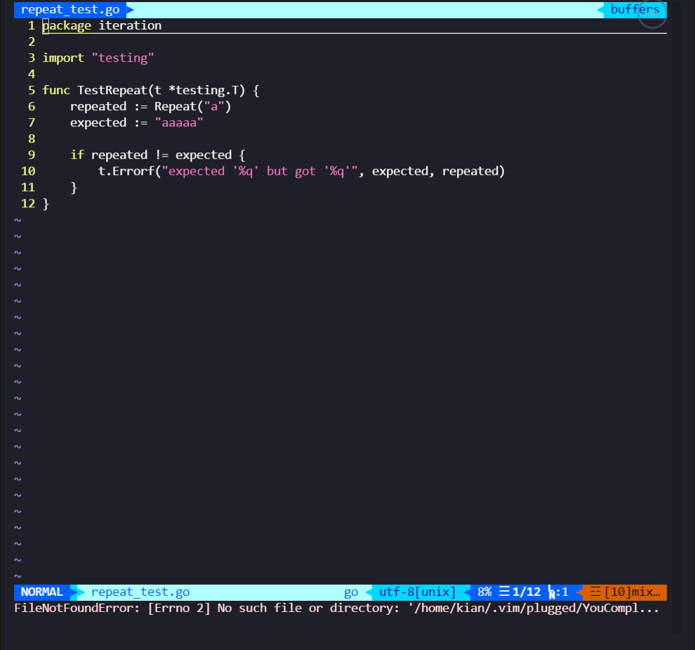

```go
package iteration

import "testing"

func TestRepeat(t *testing.T) {
    repeated := Repeat("a")
    expected := "aaaaa"

    if repeated != expected {
        t.Errorf("expected '%q' but got '%q'", expected, repeated)
    }
}
```


### 尝试运行测试

```shell
go test
```

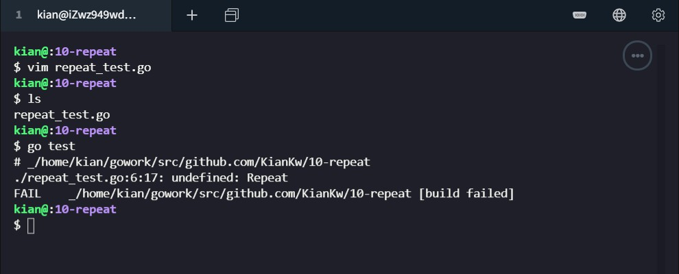

运行失败 `./repeat_test.go:6:17: undefined: Repeat`


### 先使用最少的代码来让失败的测试先跑起来

```shell
vim repeat.go
```

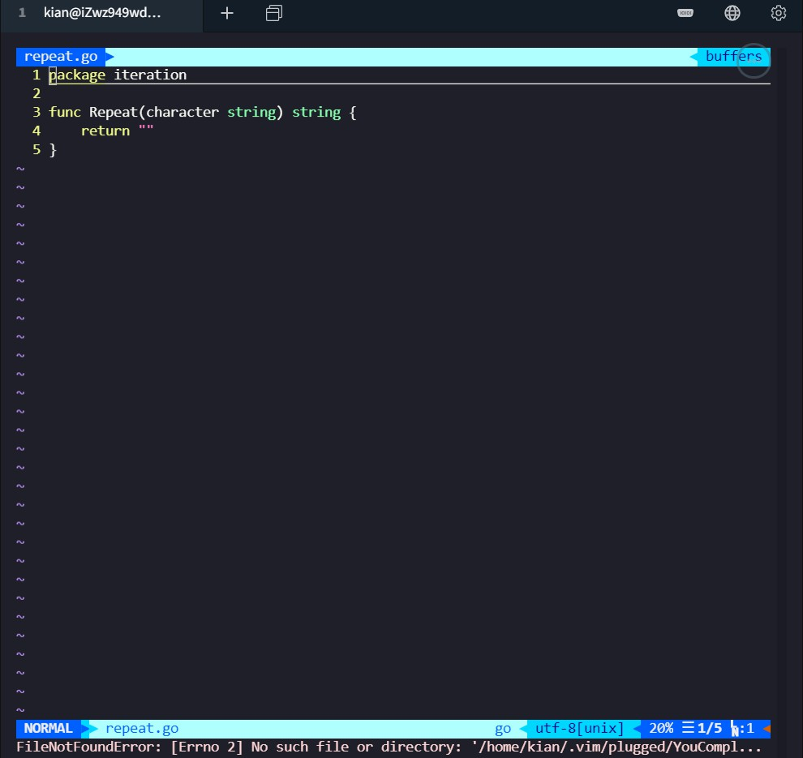

```go
package iteration

func Repeat(character string) string {
    return ""
}
```

运行

```shell
go test
```

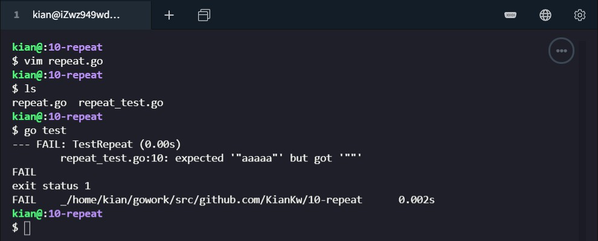

运行失败 ` repeat_test.go:10: expected '"aaaaa"' but got '""'`


### 把代码补充完整，使得它能够通过测试

```shell
vim repeat.go
```

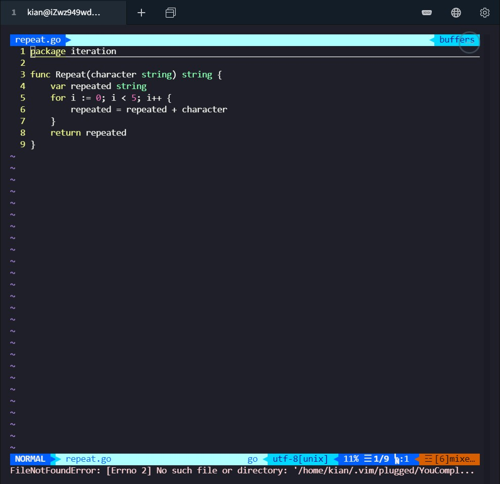

```go
package iteration

func Repeat(character string) string {
    var repeated string
    for i := 0; i < 5; i++ {
        repeated = repeated + character
    }
    return repeated
}
```

运行测试成功

```shell
go test
```

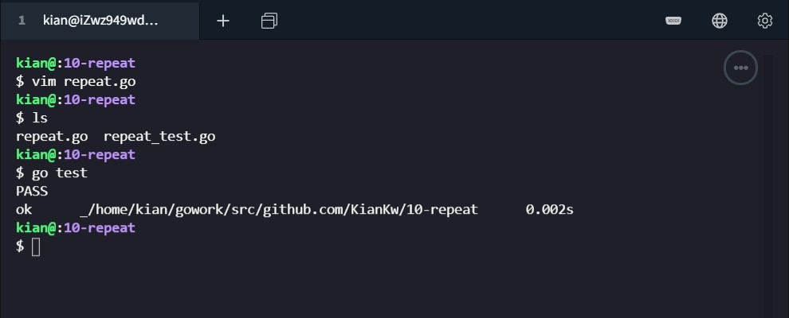


### 重构

#### 自增赋值运算符 +=

```shell
vim repeat.go
```

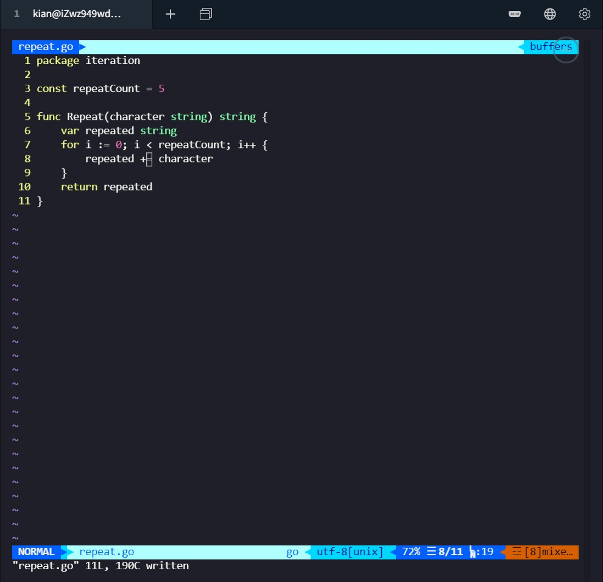

```go
package iteration

const repeatCount = 5

func Repeat(character string) string {
    var repeated string
    for i := 0; i < repeatCount; i++ {
        repeated += character
    }
    return repeated
}
```

#### 基准测试

```shell
vim repeat_test.go
```

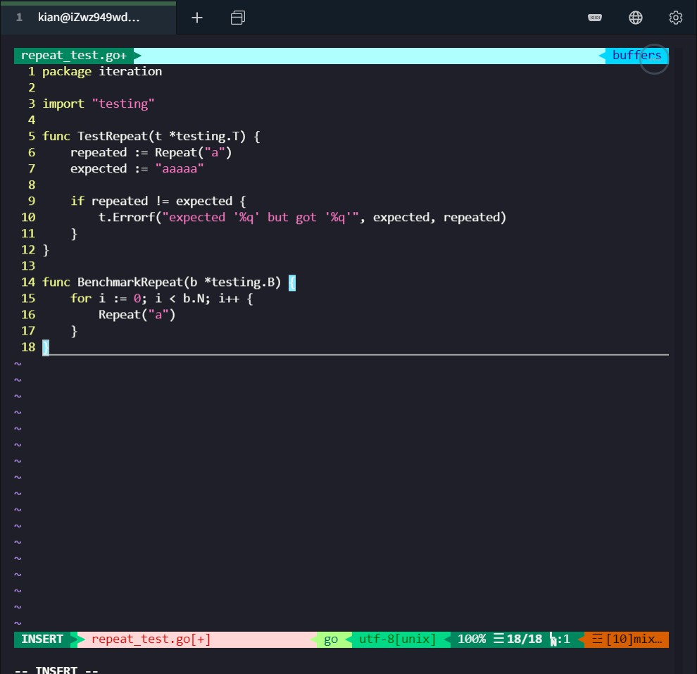

```go
func BenchmarkRepeat(b *testing.B) {
    for i := 0; i < b.N; i++ {
        Repeat("a")
    }
}
```

运行成功

```shell
go test -bench=.
```

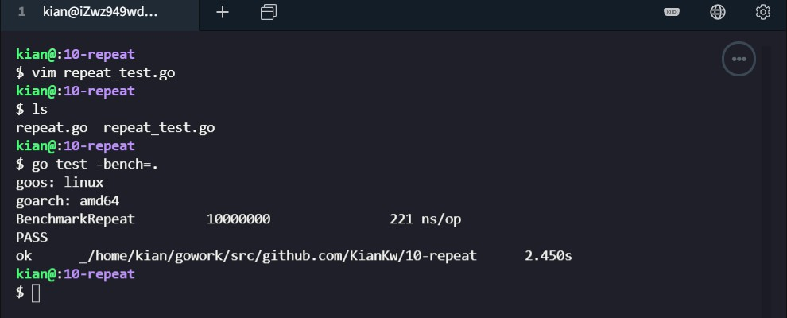


## TDD 实践报告 - 二分查找

### 先写测试函数

本次实践要完成稳定的二分查找，如果在数组中存在多个目标值，则返回第一次出现的坐标

在  `binarysearch_test.go` 中：

```GO
package main

import "testing"

func TestBinarySearch(t *testing.T) {

    t.Run("the target doesn't exist", func(t *testing.T) {
        numbers := []int{1, 2, 3, 5, 6, 7}
        target := 4
        
        got := BinarySearch(numbers, target)
        want := -1

        if got != want {
            t.Errorf("got %d want %d given, %v", got, want, numbers)
        }
    })

    t.Run("the target exists but does not repeat", func(t *testing.T) {
        numbers := []int{1, 2, 3, 4, 5, 6, 7}
        target := 2

        got := BinarySearch(numbers, target)
        want := 1

        if got != want {
            t.Errorf("got %d want %d given, %v", got, want, numbers)
        }
    })
    
    t.Run("the target exists and repeats", func(t *testing.T) {
        numbers := []int{1, 2, 3, 3, 3, 6, 8, 9}
        target := 3

        got := BinarySearch(numbers, target)
        want := 2

        if got != want {
            t.Errorf("got %d want %d given, %v", got, want, numbers)
        }
    })

}
```


### 运行测试

使用 `go test` 运行测试将会报编译时错误：`./binarysearch_test ...: undefined: BinarySearch`。

```shell
go test
```


### 先使用最少的代码来让失败的测试先跑起来

```shell
vim binarysearch.go
```


这时测试还会失败，不过会返回明确的错误信息：`binarysearch_test.go:27: got -1 want 1 given, [1 2 3 4 5 6 7]`

```shell
go test
```


### 把代码补充完整，使得它能够通过测试

采用 `len()` 函数来获得数组长度，完善稳定的二分查找算法

```shell
vim binarysearch.go
```


```go
package main                                                                   

import "fmt"

func BinarySearch(nums[]int, target int) int {
    left, right := 0, len(nums)
    for left < right {
        mid := left + (right - left) / 2
        if nums[mid] == target {
            right = mid
        } else if nums[mid] < target {
            left = mid + 1
        } else {
            right = mid
        }
    }
    if nums[left] == target {
        return left
    } else {
        return -1
    }
}

func main() {
    nums := []int{1,2,3,4,5,6,7,8,9}
    fmt.Println(BinarySearch(nums, 7))
}
```


成功通过测试

```shell
go test
```


### 重构

优化测试代码，减少代码冗余度

#### 版本 1

利用子测试，在其他测试中共享代码

```shell
vim binarysearch_test.go
```


```go
package main                                                                    
import "testing"

func TestBinarySearch(t *testing.T) {
    assertCorrectMessage := func(t *testing.T, got int, want int, numbers []int) {
         t.Helper()
        if got != want {
            t.Errorf("got %d want %d given, %v", got, want, numbers)
        }
    }

    t.Run("the target doesn't exist", func(t *testing.T) {
        numbers := []int{1, 2, 3, 5, 6, 7}
        target := 4

        got := BinarySearch(numbers, target)
        want := -1

        assertCorrectMessage(t, got, want, numbers)
    })

    t.Run("the target exists but does not repeat", func(t *testing.T) {
        numbers := []int{1, 2, 3, 4, 5, 6, 7}
        target := 2

        got := BinarySearch(numbers, target)
        want := 1

        assertCorrectMessage(t, got, want, numbers)
    })

    t.Run("the target exists and repeats", func(t *testing.T) {
        numbers := []int{1, 2, 3, 3, 3, 6, 8, 9}
        target := 3

        got := BinarySearch(numbers, target)
        want := 2

        assertCorrectMessage(t, got, want, numbers)
    })
}
```

运行测试成功

```shell
go test
```


#### 版本 2

利用普通遍历，自动获得期望答案

```shell
vim binarysearch_test.go
```

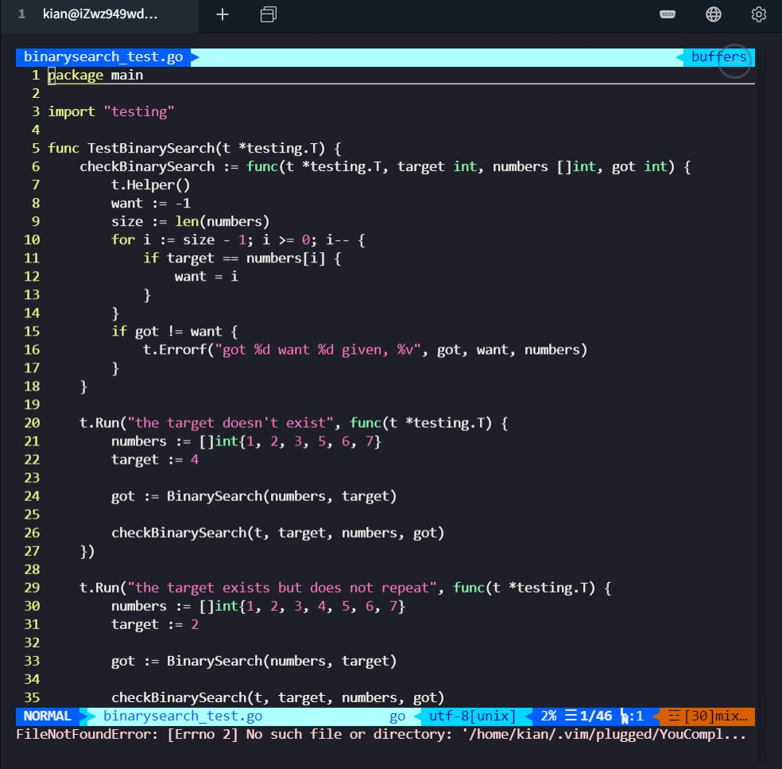

```go
package main

import "testing"

func TestBinarySearch(t *testing.T) {
	checkBinarySearch := func(t *testing.T, target int, numbers []int, got int) {
		t.Helper()
		want := -1
		size := len(numbers)
		for i := size - 1; i >= 0; i-- {
			if target == numbers[i] {
				want = i
			}
		}
		if got != want {
            t.Errorf("got %d want %d given, %v", got, want, numbers)
		}
	}

	t.Run("the target doesn't exist", func(t *testing.T) {
        numbers := []int{1, 2, 3, 5, 6, 7}
        target := 4

        got := BinarySearch(numbers, target)

		checkBinarySearch(t, target, numbers, got)
	})

	t.Run("the target exists but does not repeat", func(t *testing.T) {
	    numbers := []int{1, 2, 3, 4, 5, 6, 7}
	    target := 2

	    got := BinarySearch(numbers, target)

		checkBinarySearch(t, target, numbers, got)
	})

	t.Run("the target exists and repeats", func(t *testing.T) {
	    numbers := []int{1, 2, 3, 3, 3, 6, 8, 9}
	    target := 3

	    got := BinarySearch(numbers, target)

		checkBinarySearch(t, target, numbers, got)
	})
}
```

运行测试成功

```shell
go test
```

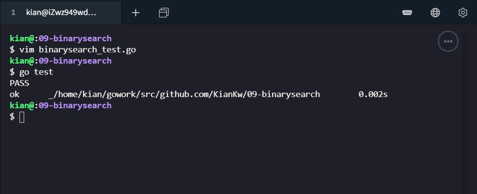


### 总结

我学习了

* `for` 循环
* 如何编写基准测试
* 数组和切片
* 使用 `len` 获取数组和切片的长度
* TDD 的基本思想
* 稳定版的二分查找