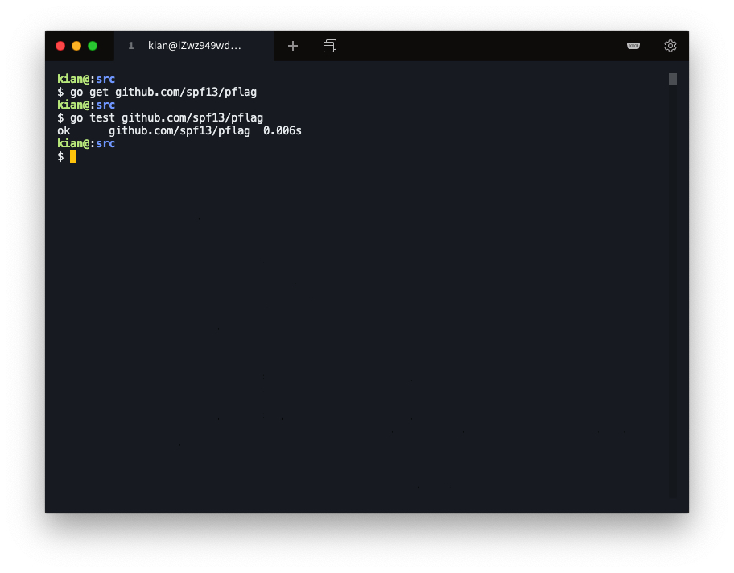
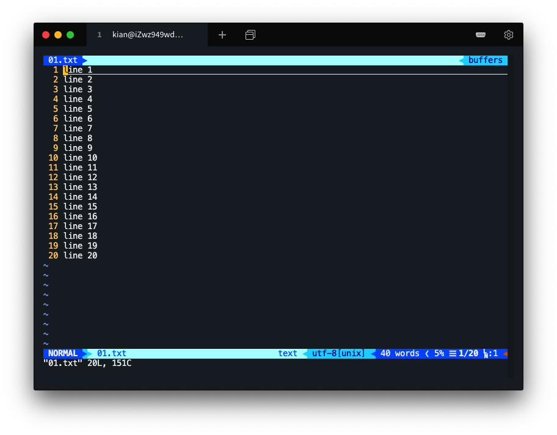
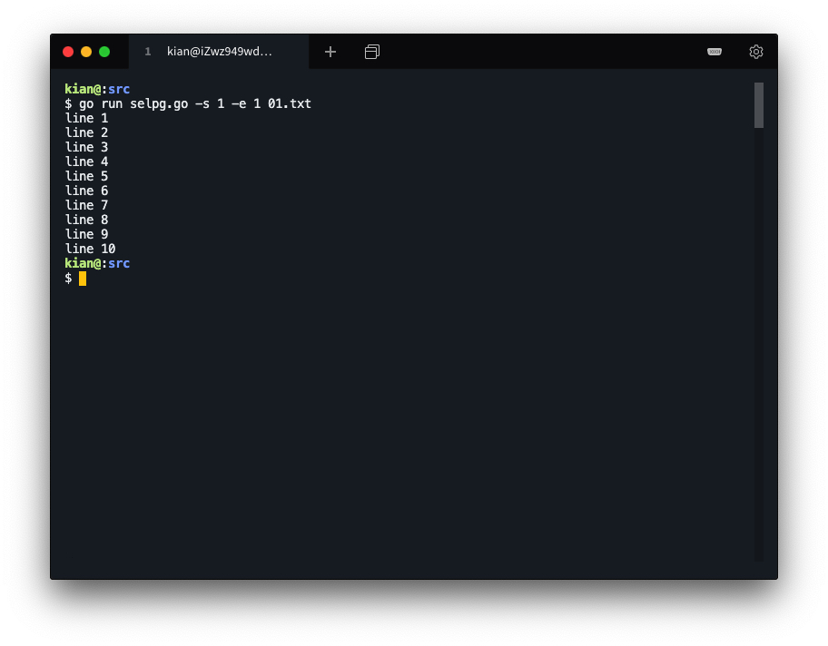
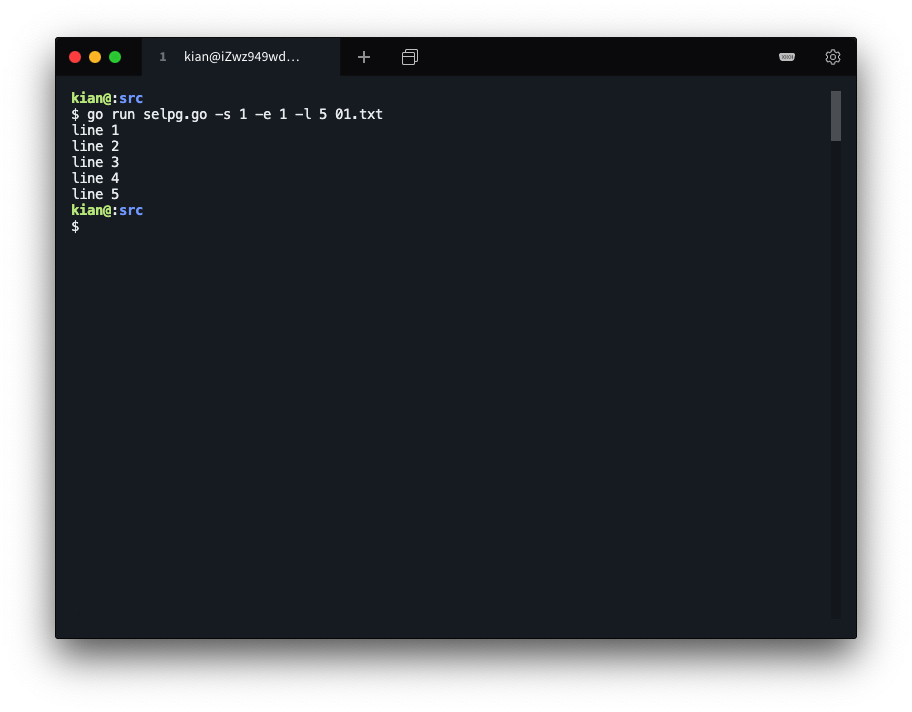
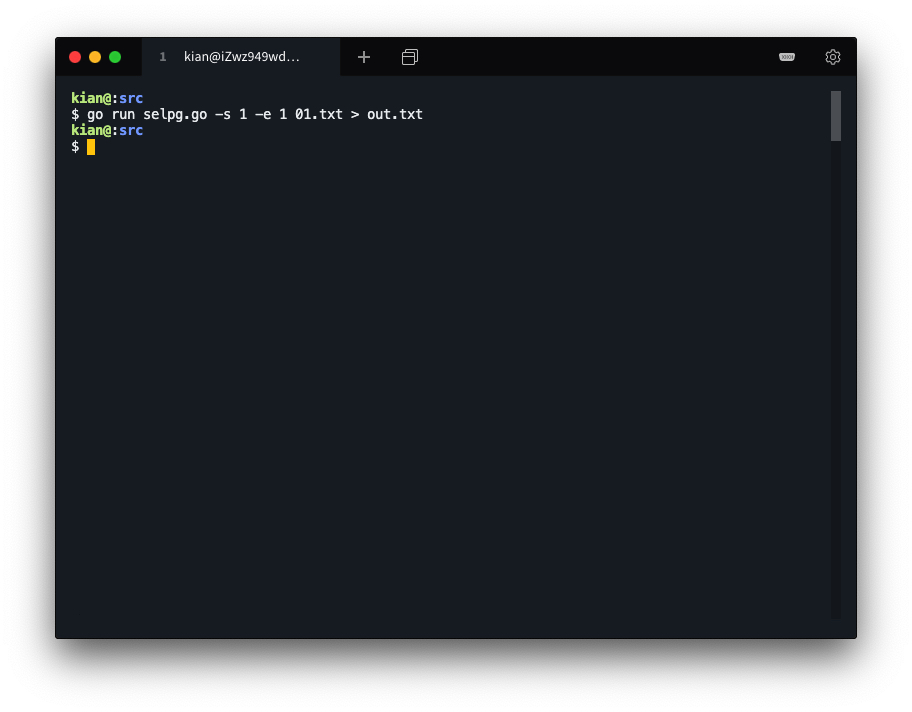
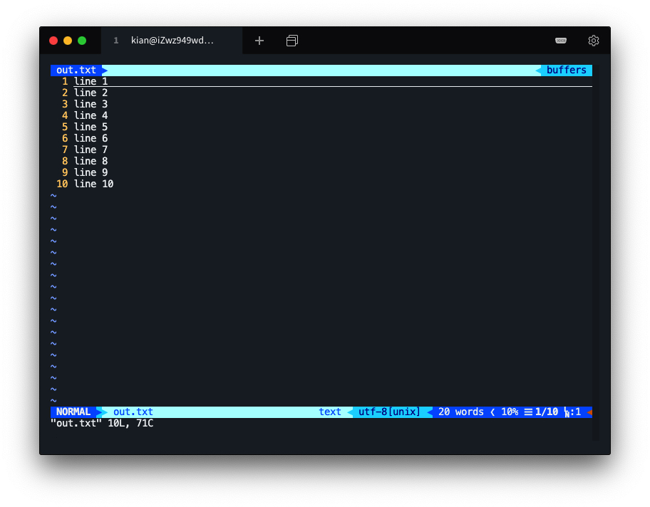
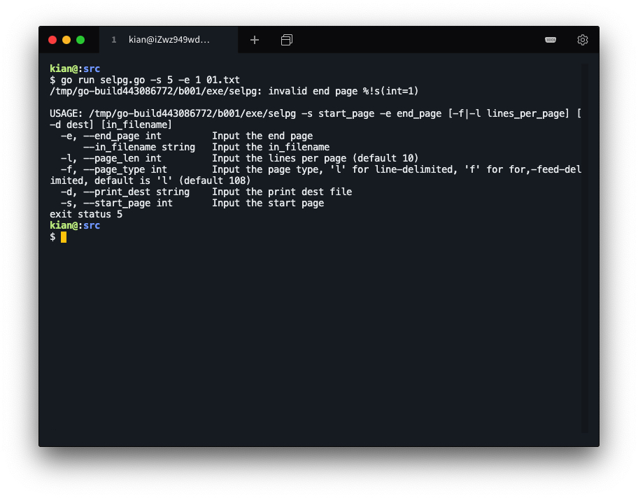
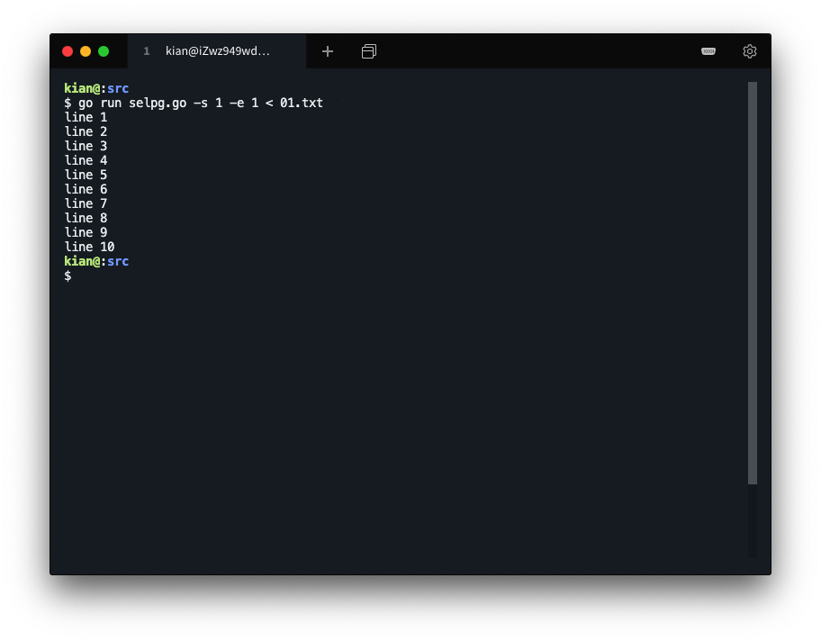
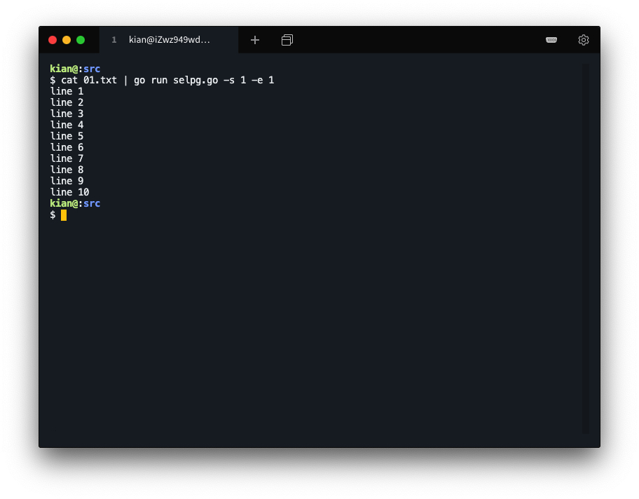
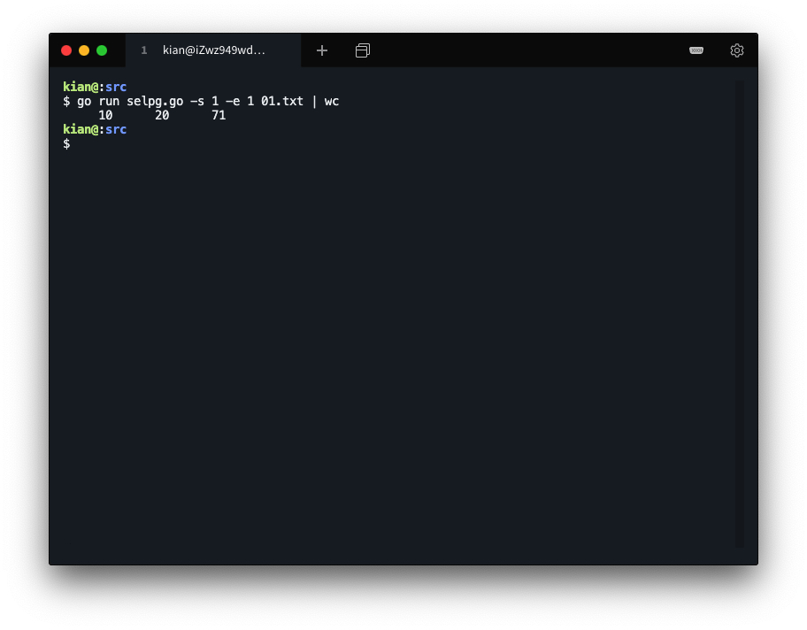

# 开发简单 CLI 程序

### 环境说明

（阿里云服务器）

操作系统：`Ubuntu 18.04.4 LTS (GNU/Linux 4.15.0-96-generic x86_64)`

编辑器：`vim`

编译工具：`go version go1.10.4 linux/amd64` 


## 实验要求

使用 golang 开发 [开发 Linux 命令行实用程序](https://www.ibm.com/developerworks/cn/linux/shell/clutil/index.html) 中的 **selpg**

* 请按文档 **使用 selpg** 章节要求测试你的程序
* 请使用 pflag 替代 goflag 以满足 Unix 命令行规范， 参考：
* golang 文件读写、读环境变量，请自己查 os 包
* “-dXXX” 实现，请自己查 `os/exec` 库，例如案例 [Command](https://godoc.org/os/exec#example-Command)，管理子进程的标准输入和输出通常使用 `io.Pipe`，具体案例见 [Pipe](https://godoc.org/io#Pipe)
* 请自带测试程序，确保函数等功能正确


## 实验过程


### 学习相关知识

#### 命令行准则

* 输入

  * 在命令行上指定的文件名

    ```shell
    command input_file
    ```

  * 标准输入（stdin），缺省情况下为终端

    ```shell
    command
    ```

    输入 Control-D（文件结束指示符）前输入的所有内容都成为 command 的输入

  * 操作符“<”（重定向标准输入），也可将标准输入重定向为来自文件

    ```shell
    command < input_file
    ```

  * 操作符“|”（pipe）也可以使标准输入来自另一个程序的标准输出

    ```shell
    other_command | command
    ```

    other_command 的标准输出（stdout）被 shell／内核透明地传递至 command 的标准输入

* 输出

  * 缺省情况下标准输出为终端

    ```shell
    command
    ```

  * 操作符“>”（重定向标准输出）可以将标准输出重定向至文件

    ```shell
    command > output_file
    ```

  * “|”操作符，command 的输出可以成为另一个程序的标准输入

    ```shell
    command | other_command
    ```

    command 的输出成为 other_command 的输入

* 错误输出

  * 缺省情况下标准错误为终端

    ```shell
    command
    ```

  * 操作符“>”（重定向标准输出）可以将标准错误重定向至文件

    ```shell
    command 2>error_file
    ```

    标准输出和标准错误都重定向至不同的文件

    ```shell
    command >output_file 2>error_file
    ```

    首先将标准输出重定向至 output_file；因此“2>&1”将使标准错误也被重定向至 output_file

    ```shell
    command >output_file 2>&1
    ```

    

  * “|”操作符，command 的输出可以成为另一个程序的标准输入

    ```shell
    command | other_command
    ```

    command 的输出成为 other_command 的输入

* 执行

* 命令行参数

  * Linux 实用程序语法图看起来如下：

    ```shell
    command mandatory_opts [ optional_opts ] [ other_args ]
    ```

#### Pflag

pflag 包与 flag 包的工作原理、代码实现都是类似的。

pflag 有以下优势

* 支持更加精细的参数类型
* 支持更多参数类型
* 兼容标准 flag 库的 Flag 和 FlagSet
* 支持更丰富的功能

常用函数

* flag.String(), flag.Bool(), flag.Int(), flag.Float64() 返回对应类型的指针
* flag.XxxVar() 将参数绑定到对应类型的指针
* flag.Var() 绑定自定义类型
  自定义类型需要实现Value接口。Var定义了一个有指定名字和用法说明的标签。
* flag.Parse() 解析命令行参数到定义的 flag 解析函数将会在碰到第一个非 flag 命令行参数时停止，非 flag 命令行参数是指不满足命令行语法的参数。
* flag.Args()，flag.Arg(i)，flag.NArg()
  在命令行标签被解析之后，flag.NArg()就返回解析后参数的个数。


### 环境配置

go 环境配置参考之前的作业 [GitHub KianKw](https://github.com/KianKw/service-computing-hw/blob/master/hw01/hw01.md)

另外，使用 pflag 替代 goflag 以满足 Unix 命令行规范，需要提前安装 pflag 包。

安装 pflag 包并进行测试

```shell
go get github.com/spf13/pflag
go test github.com/spf13/pflag
```



### 参数分析

- `-s [Number]` :Start Page，后面接开始读取的页号。
- `-e [Number]` :End Page，后面接结束读取的页号
- `-l [Number]` :后面跟行数，代表多少行分为一页，默认为10
- `-f` :程序自动忽略`-l` ，在整个文档中寻找换行符 `\f` ，并且将其作为分页的标志。
- `-d [dest]` :Destination 可接受的打印目的地名称，selpg程序加上 -d 参数之后，表示 Destination 打印机打印输入数据。
- `[In_file]` :输入文件名。在所有`-`类型参数后指定，`selpg` 会自动查找，如果查找不到，就读取stdin中的内容作为输入。
- `-s`和`-e`是必须的参数，其它为可选参数，`-l`和`-f`参数不能同时出现


### 编写代码

#### 导入所需包

```go
import (
	"fmt"
	"io"
	"os"
	"bufio"
	"strconv"
	"os/exec"
	flag "github.com/spf13/pflag"
)
```

#### 定义结构体

设置程序的参数结构体。提取参数将值赋值给该结构体：

- start_page：起始页
- end_page：结束页
- in_filename: 输入的文件名
- destination：`-d` 后面跟着的目的地
- page_len：每页的行数
- page_type：判断页的类型

```go
type selpg_args struct {
	start_page int
	end_page int
	in_filename string
	page_len int
	page_type int

	print_dest string
}
```

#### main 函数

这里主要使用`flag.XxxVarP()`函数将 flag 绑定到 sa 的各个变量上。

```go
func main() {
	sa := selpg_args{}

	/* save name by which program is invoked, for error messages */
	progname = os.Args[0]

	flag.IntVarP(&sa.start_page, "start_page", "s", 0, "Input the start page")
	flag.IntVarP(&sa.end_page, "end_page", "e",  0, "Input the end page")
	flag.StringVarP(&sa.in_filename, "in_filename", "", "", "Input the in_filename");
	flag.IntVarP(&sa.page_len, "page_len", "l", 10, "Input the lines per page")
	flag.IntVarP(&sa.page_type, "page_type", "f", 'l', "Input the page type, 'l' for line-delimited, 'f' for for,-feed-delimited, default is 'l'")
	flag.StringVarP(&sa.print_dest, "print_dest", "d", "", "Input the print dest file")
	flag.Parse()
	
	process_args(&sa)
	process_input(sa)
}
```

#### process_args 函数

校验参数函数，这个函数主要是用于处理输入时候的各种错误。使用os.Args读取程序输入的所有参数，并进行合法性检验，包括对每个参数的格式是否正确进行判断，对参数的个数是否正确进行判断，还有参数大小是否在合法范围内进行判断等等。得到的值是包含参数的string数组，然后将参数的值提取出来赋值给结构体。

```go
func process_args(psa * selpg_args) {
	ac := len(os.Args)
	var s1 string /* temp str */
	var i int

	/* check the command-line arguments for validity */
	if ac < 3 {	/* Not enough args, minimum command is "selpg -sstartpage -eend_page"  */
		fmt.Fprintf(os.Stderr, "%s: not enough arguments\n", progname)
		usage()
		os.Exit(1)
	}

	/* handle mandatory args first */
	/* handle 1st arg - start page */
	s1 = os.Args[1] /* !!! PBO */
	if s1 != "-s" {
		fmt.Fprintf(os.Stderr, "%s: 1st arg should be -s start_page\n", progname)
		usage()
		os.Exit(2)
	}
	INT_MAX := 1 << 32
	s1 = os.Args[2]
	i, _ = strconv.Atoi(s1)
	if i < 1 || i > (INT_MAX - 1) {
		fmt.Fprintf(os.Stderr, "%s: invalid start page %s\n", progname, psa.start_page)
		usage()
		os.Exit(3)
	}
	psa.start_page = i

	/* handle 2nd arg - end page */
	s1 = os.Args[3] /* !!! PBO */
	if s1 != "-e" {
		fmt.Fprintf(os.Stderr, "%s: 2nd arg should be -e end_page\n", progname)
		usage()
		os.Exit(4)
	}
	s1 = os.Args[4]
	i, _ = strconv.Atoi(s1)
	if i < 1 || i > (INT_MAX - 1) || i < psa.start_page {
		fmt.Fprintf(os.Stderr, "%s: invalid end page %s\n", progname, psa.end_page)
		usage()
		os.Exit(5)
	}

	/* now handle optional args */
	/* handle page_len */
	if psa.page_len < 1 || psa.page_len > (INT_MAX - 1) {
		fmt.Fprintf(os.Stderr, "%s: invalid page length %s\n", progname, psa.page_len)
		usage()
		os.Exit(6)
	}
	
	/* handle in_filename */ 
	if len(flag.Args()) == 1 { /* there is one more arg */
		_, err := os.Stat(flag.Args()[0])
		/* check if file exists */
		if err != nil && os.IsNotExist(err) {
			fmt.Fprintf(os.Stderr, "%s: input file \"%s\" does not exist\n",
					progname, flag.Args()[0]);
			os.Exit(7);
		}
		psa.in_filename = flag.Args()[0]
	}
}
```

#### process_input 函数

处理输入命令函数，用来对文件的内容进行处理，然后根据后缀参数的类型完成相应操作。

当用户指定了输出地点时，我们创建子程序 cat 来将输出流的内容打印到指定地点。

```go
func process_input(sa selpg_args) {
	var fin *os.File /* input stream */
	var fout io.WriteCloser /* output stream */
	var page_ctr int /* page counter */
	var line_ctr int /* line counter */

	/* set the input source */
	if len(sa.in_filename) == 0 {
		fin = os.Stdin
	} else {
		var err error
		fin, err = os.Open(sa.in_filename)
		if err != nil {
			fmt.Fprintf(os.Stderr, "%s: could not open input file \"%s\"\n",
				progname, sa.in_filename)
			os.Exit(8)
		}
		defer fin.Close()
	}

	/* use  bufio.NewReader() to set a big buffer for fin, for performance */
	bufFin := bufio.NewReader(fin)

	/* set the output destination */
	cmd := &exec.Cmd{}
	if len(sa.print_dest) == 0 {
		fout = os.Stdout
	} else {
		cmd = exec.Command("cat")	
		var err error
		cmd.Stdout, err = os.OpenFile(sa.print_dest, os.O_WRONLY|os.O_CREATE, 0666)
		if err != nil {
			fmt.Fprintf(os.Stderr, "%s: could not open file %s\n",
				progname, sa.print_dest)
			os.Exit(9)
		}

		fout, err = cmd.StdinPipe()
		if err != nil {
			fmt.Fprintf(os.Stderr, "%s: could not open pipe to file %s\n",
				progname, sa.print_dest)
			os.Exit(10)
		}
		
		cmd.Start()
		defer fout.Close()
	}

	/* begin one of two main loops to print result based on page type */
	if sa.page_type == 'l' {
		line_ctr = 0
		page_ctr = 1
		for {
			line,  err := bufFin.ReadString('\n')
			if err != nil {	/* error or EOF */
				break
			}
			line_ctr++
			if line_ctr > sa.page_len {
				page_ctr++
				line_ctr = 1
			}
			if (page_ctr >= sa.start_page) && (page_ctr <= sa.end_page) {
				_, err := fout.Write([]byte(line))
				if err != nil {
					fmt.Println(err)
					os.Exit(11)
				}
		 	}
		}  
	} else {
		page_ctr = 1
		for {
			page, err := bufFin.ReadString('\f')
			if err != nil { /* error or EOF */
				break
			}
			if (page_ctr >= sa.start_page) && (page_ctr <= sa.end_page) {
				_, err := fout.Write([]byte(page))
				if err != nil {
					os.Exit(12)
				}
			}
			page_ctr++
		}
	}

	/* end main loop */
	
	if page_ctr < sa.start_page {
		fmt.Fprintf(os.Stderr,
			"%s: start_page (%d) greater than total pages (%d)," +
			" no output written\n", progname, sa.start_page, page_ctr)
	} else if page_ctr < sa.end_page {
		fmt.Fprintf(os.Stderr,"%s: end_page (%d) greater than total pages (%d)," +
		" less output than expected\n", progname, sa.end_page, page_ctr)
	}
}
```

#### usage 函数

打印报错信息函数。在打印错误信息后，又打印了各个参数的使用说明。

```go
func usage() {
	fmt.Fprintf(os.Stderr, "\nUSAGE: %s -s start_page -e end_page [-f|-l lines_per_page] [-d dest] [in_filename]\n", progname);
	flag.PrintDefaults()
}
```


## 实验测试

编写测试文件



### 测试 1

普通测试

```shell
go run selpg.go -s 1 -e 1 01.txt
```



### 测试 2

定义行号测试

```shell
go run selpg.go -s 1 -e 1 -l 5 01.txt
```



### 测试 3

将输出保存到文件测试

```shell
go run selpg.go -s 1 -e 1 01.txt > out.txt
```



```shell
vim out.txt
```



### 测试 4

输入行号错误检测



### 测试 5

测试命令行准则

* 操作符“<”（重定向标准输入）

  ```shell
  go run selpg.go -s 1 -e 1 < 01.txt
  ```

  

* 操作符“>”（重定向标准输出）

  ```shell
  go run selpg.go -s 1 -e 1 01.txt > out.txt
  ```

  

* 操作符“|”（pipe）使标准输入来自另一个程序的标准输出

  ```shell
  cat 01.txt | go run selpg.go -s 1 -e 1
  ```

  

* “|”操作符，command 的输出成为另一个程序的标准输入

  ```shell
  go run selpg.go -s 1 -e 1 01.txt | wc
  ```

  