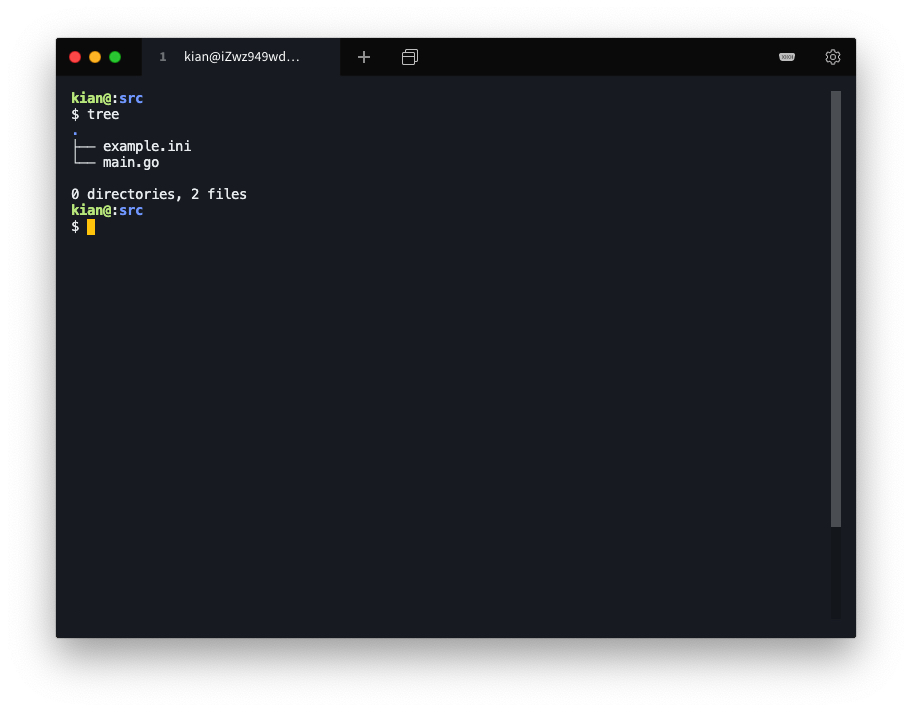
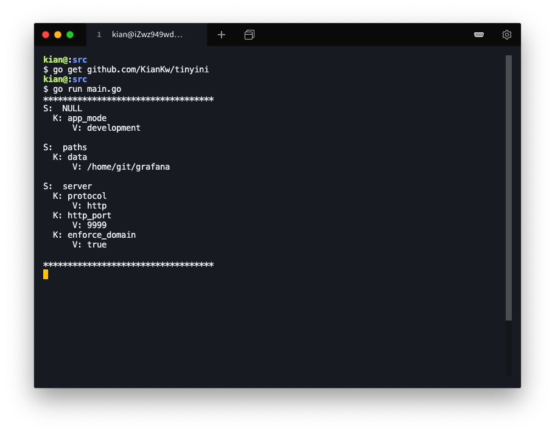
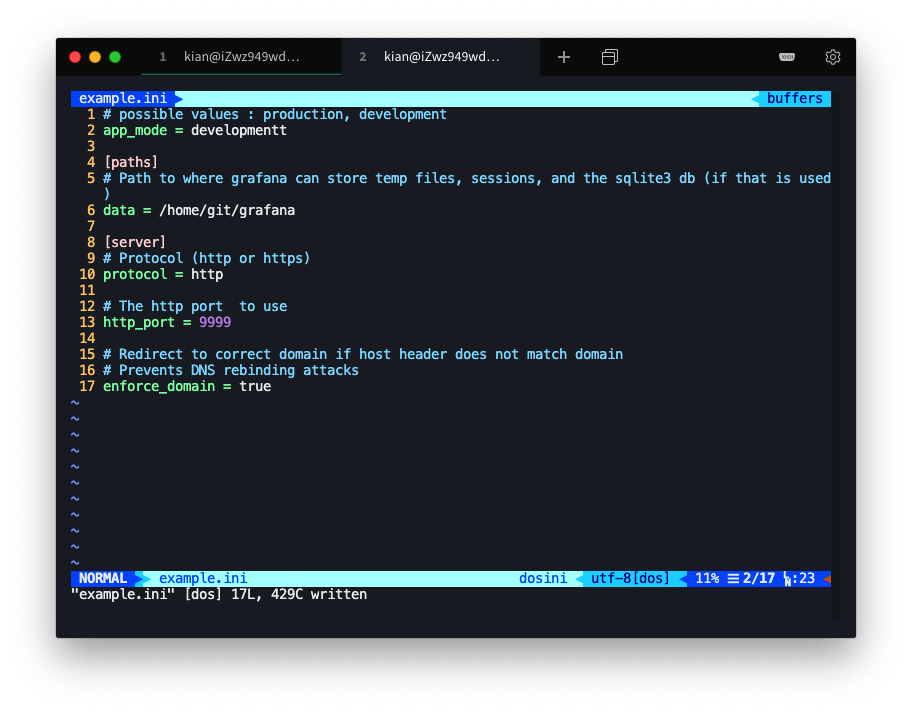
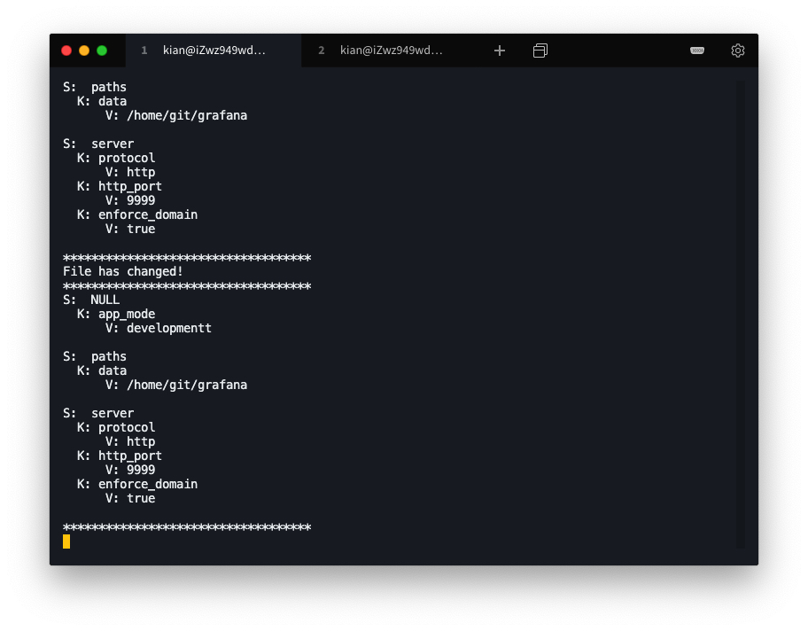

# Tinyini

## Background

Package tinyini provides INI file read and write functionality in Go.

This project is part of the assignment for the Service Computing course.

## Install

This project uses go. Please configure the Go Language environment. Go check it out if you don't have it locally installed.

```shell
go get github.com/KianKw/tinyini
```

## Usage

main.go

```go
package main

import (
	"github.com/KianKw/tinyini"
)

func main() {
	var listen tinyini.ListenFunc
	tinyini.Watch("example.ini", listen)
}
```

example.ini

```ini
# possible values : production, development
app_mode = development

[paths]
# Path to where grafana can store temp files, sessions, and the sqlite3 db (if that is used)
data = /home/git/grafana

[server]
# Protocol (http or https)
protocol = http

# The http port  to use
http_port = 9999

# Redirect to correct domain if host header does not match domain
# Prevents DNS rebinding attacks
enforce_domain = true
```

The file structure is as follows.

```shell
tree
```



Run the program.

```shell
go run main.go
```



Make some changes to file example.ini



Observe changes in the program



