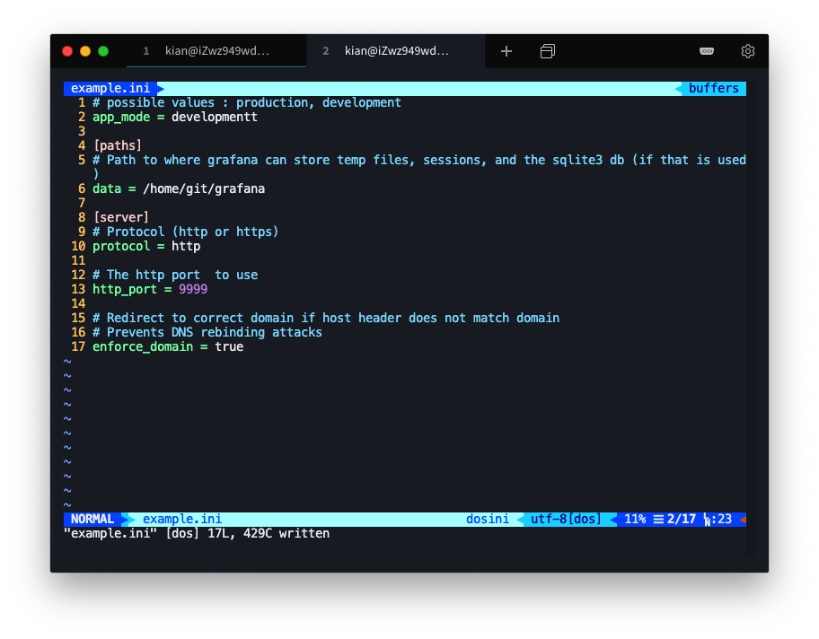
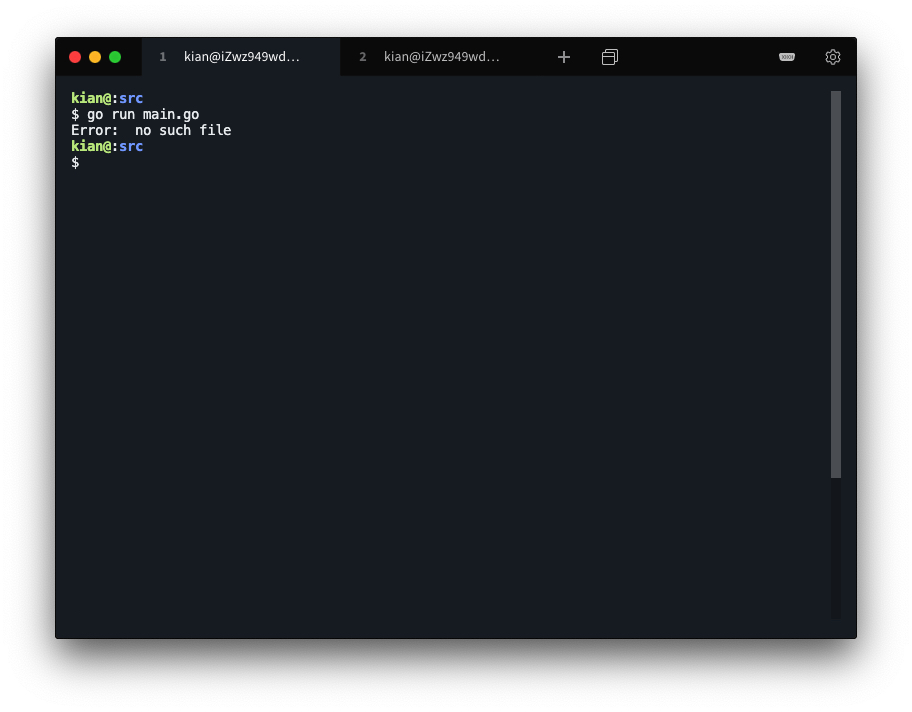

# 程序包开发 - 读简单配置文件

### 环境说明

（阿里云服务器）

操作系统：`Ubuntu 18.04.4 LTS (GNU/Linux 4.15.0-96-generic x86_64)`

编辑器：`vim`

编译工具：`go version go1.10.4 linux/amd64` 


## 实验要求

发布一个读配置文件程序包，第一版仅需要读 ini 配置

- 生成的中文 api 文档
- 有较好的 Readme 文件，包括一个简单的使用案例
- 每个go文件必须有对应的测试文件
- 必须提供自定义错误
- 使有 init 函数，使得 Unix 系统默认采用 `#` 作为注释行，Windows 系统默认采用 `;` 作为注释行。


## 实现要求

* [中文 api 文档](https://github.com/KianKw/tinyini/blob/main/API.md)

* [Readme 文件](https://github.com/KianKw/tinyini/blob/main/README.md)

* [测试文件](https://github.com/KianKw/tinyini/)

* [自定义错误](https://github.com/KianKw/tinyini/blob/main/error.go)

* init 函数

    ```go
    // Depending on the operating system, determine the symbol of the annotation
    func init() {
    	sysType := runtime.GOOS
    	if sysType == "windows" {
    		annotationFlag = ";"
    	} else if sysType == "linux" {
    		annotationFlag = "#"
    	}
    }
    ```


## 测试

### 测试 1

单元测试


### 测试 2

案例测试

main.go

```go
package main

import (
	"github.com/KianKw/tinyini"
)

func main() {
	var listen tinyini.ListenFunc
	tinyini.Watch("example.ini", listen)
}
```

example.ini

```ini
# possible values : production, development
app_mode = development

[paths]
# Path to where grafana can store temp files, sessions, and the sqlite3 db (if that is used)
data = /home/git/grafana

[server]
# Protocol (http or https)
protocol = http

# The http port  to use
http_port = 9999

# Redirect to correct domain if host header does not match domain
# Prevents DNS rebinding attacks
enforce_domain = true
```

The file structure is as follows.

```shell
tree
```


Run the program.

```shell
go run main.go
```


Make some changes to file example.ini



Observe changes in the program


### 测试 3

错误测试 - 文件不存在




