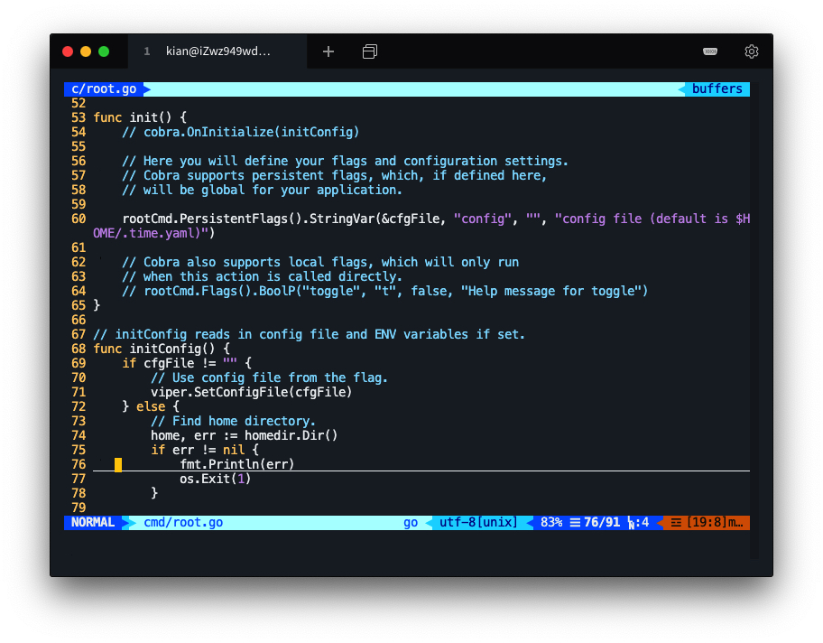
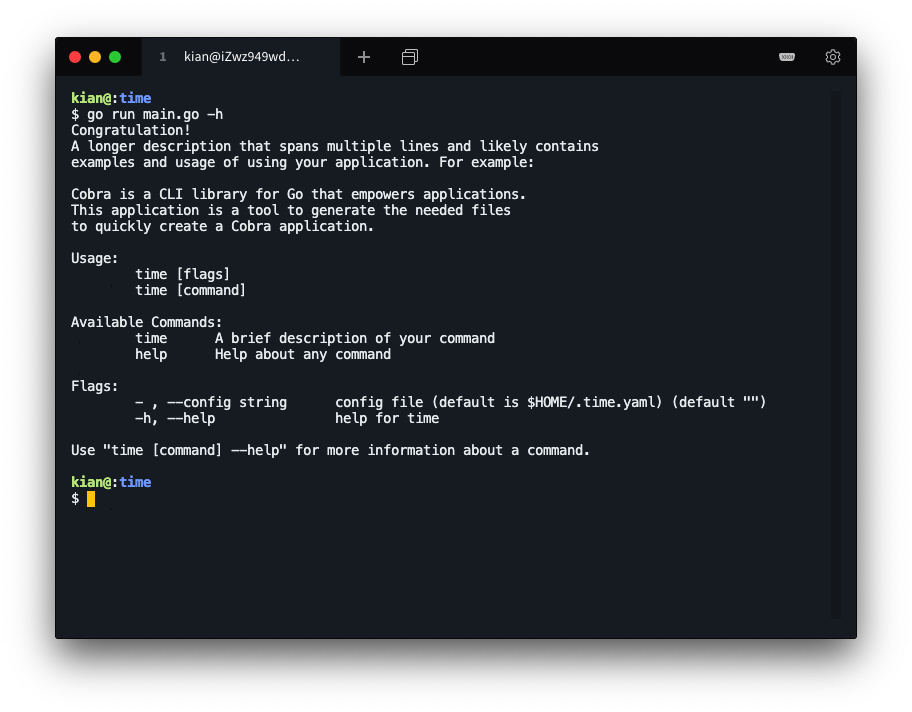

# MyCobra

## Background

MyCobra is a simple imitation of [Cobra](https://github.com/spf13/cobra) for learning the go language.

> Cobra is both a library for creating powerful modern CLI applications as well as a program to generate applications and command files.

This project is part of the assignment for the Service Computing course.

## Install

1. This project uses go. Please configure the Go Language environment. Go check it out if you don't have it locally installed.

2. To initialize the project more quickly, the repository uses Cobra. Please install Cobra firstly.

    ```shell
    go get -v github.com/spf13/cobra/cobra
    ```

    PS: [CSDN KianKwok blog](https://blog.csdn.net/KianKwok/article/details/109325079): this is the detailed installation process of Cobra.

3. Run the following command to install MyCobra.

    ```shell
    go get -v github.com/KianKw/myCobra
    ```

## Usage

> The usage code is in the `time` folder.

#### Use Cobra to initialize the file

Initialize a project named Time with the official Cobra and add a subcommand time to the project.

```shell
cd $GOPATH/src
mkdir time
cd time
cobra init --pkg-name time
cobra add time
```

The organizational structure is as follows


#### Modify the file to fit MyCobra

Modify the `cmd` folder file import library, ` "github.com/spf13/cobra/" ` modified to ` cobra" github.com/KianKw/myCobra" `.

Turn `cobra.OnInitialize(initConfig)` and `rootCmd.Flags().BoolP()` rows in the init func in the `cmd /root.go` file into annotations.



Run main.go, which is imported myCobra.

```shell
go run main.go
```


#### Test the functionality of the MyCobra

Run main.go with the added parameter.



Add content for the time subcommand.

In the `time.go` file, import the "time" library and add the following code at the end of the Run func.

```go
fmt.Println(time.Now())
```

Run the time subcommand


Run the time subcommand with the added parameter.


