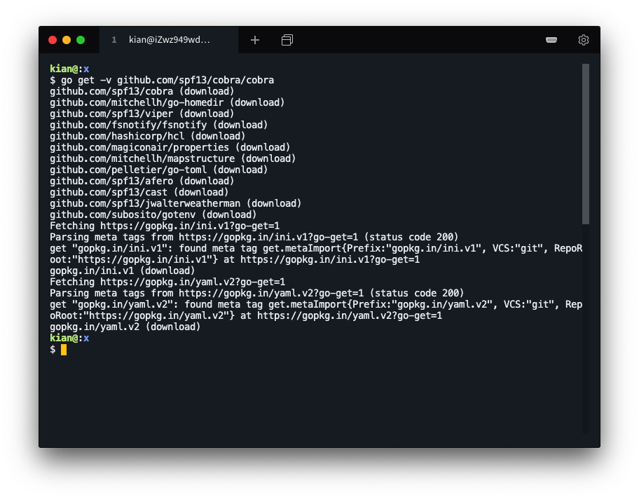
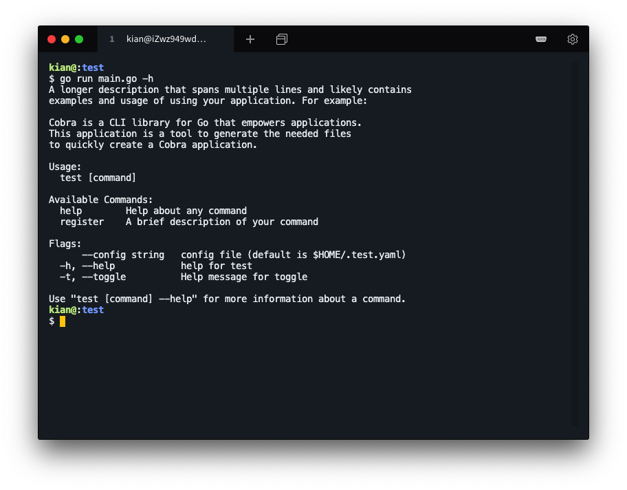

# 程序包开发 - 复杂命令行支持

### 环境说明

（阿里云服务器）

操作系统：`Ubuntu 18.04.4 LTS (GNU/Linux 4.15.0-96-generic x86_64)`

编辑器：`vim`

编译工具：`go version go1.10.4 linux/amd64`

## 实验要求

- 了解 Cobra包，使用 cobra 命令行生成一个简单的带子命令的命令行程序
- 模仿 cobra.Command 编写一个 myCobra 库
- 将带子命令的命令行处理程序的 import (“github.com/spf13/cobra”) 改为 import (corbra “gitee.com/yourId/yourRepo”)
- 使得命令行处理程序修改代价最小，即可正常运行

## 了解 Cobra 包

### Croba 简介

* cobra 是一个接口，用于创建 CLI 接口，类似于 git 、go 工具
* cobra 是一个程序，可以快速开发基于 cobra 的其他程序

- cobra 建立在由 commands、arguments、flags 组成的结构体上

    - commands 代表 action
    - Args 代表 things
    - Flags 是这些 action 的修饰符

- 模式

    - `APPNAME VARB NOUN --ADJECTIVE`

        如 `git clone URL --bare`

    - `APPNAME COMMAND ARG --FLAG`

        如 `hugo server --port=1313`

- 命令 Commands

    - 命令是应用程序的中心点。
    - 应用程序支持的每个交互将包含在一个命令中。
    - 命令可以有子命令并可选择运行操作。

- 标志 Flags

    - flag 是修改命令行为的方法
    - cobra 完全兼容 POSIX-compliant flags 和 Go flag
    - cobra 可以定义
        - 持续到子命令的 flag
        - 仅对当前命令可用的 flag
    - cobra 的 flag 功能是由 pflag 库提供的

### Cobra 安装

Cobra 安装需要依赖 golang 的 sys 和 text 包，下载安装 sys 和 text 包

```shell
cd $GOPATH/src/golang.org/x/
git clone https://github.com/golang/sys
git clone https://github.com/golang/text
```


安装 Cobra

```shell
go get -v github.com/spf13/cobra/cobra
```



测试安装是否成功

```shell
cobra
```


### Cobra 简单使用

使用 cobra 创建一个项目

```shell
cd $GOPATH/src
mkdir test
cd test
cobra init --pkg-name test
```


查看组织结构

添加新命令 register 并运行

```shell
cobra add register
go run main.go register
```

自定义修改 register 命令

```shell
vim cmd/register.go
```

在 Run 中添加

```go
username, _ := cmd.Flags().GetString("user")
fmt.Println("register called by " + username)
```

在 init 中添加

```go
registerCmd.Flags().StringP("user", "u", "Anonymous", "Help message for username")
```

测试运行

```shell
go run main.go register --user=Kian
```


查看 help

```shell
go run main.go -h
```



## 模仿 Cobra 编写一个 myCobra 库

### 核心

模仿 cobra 库的 command.go 重写一个 Command.go

- 仅允许使用的第三方库 flag “github.com/spf13/pflag”
- 可以参考、甚至复制原来的代码
- 必须实现简化版的 type Command struct 定义和方法
- 不一定完全兼容 github.com/spf13/cobra
- 可支持简单带子命令的命令行程序开发

### 实现过程

- Command 结构体：存储Use、Short、Long、Run等变量和方法的基本信息

    ```go
    type Command struct {
    	Use string
    
    	Short string
    
    	Long string
    
    	Run func(cmd *Command, args []string)
    
    	RunE func(cmd *Command, args []string) error
    
    	helpFunc func(*Command, []string)
    
    	helpCommand *Command
    
    	args []string
    
    	parent *Command
    
    	commands []*Command
    
    	pflags *flag.FlagSet
    }
    ```

- AddCommand 方法：添加该命令下的子命令

    ```go
    func (cmd *Command) AddCommand(subCmds ...*Command) {
    	for i, subCmd := range subCmds {
    		if subCmds[i] == cmd {
    			panic("Command can't be a child of itself")
    		}
    		subCmds[i].parent = cmd
    		cmd.commands = append(cmd.commands, subCmd)
    	}
    }
    ```

- RemoveCommand 方法：移除子命令

    ```go
    func (cmd *Command) RemoveCommand(rmCmds ...*Command) {
    	commands := []*Command{}
    main:
    	for _, command := range cmd.commands {
    		for _, rmCmd := range rmCmds {
    			if command == rmCmd {
    				command.parent = nil
    				continue main
    			}
    		}
    		commands = append(commands, command)
    	}
    	cmd.commands = commands
    }
    ```

- Execute、execute方法：执行相应命令操作，即对应Run函数

    ```go
    func (cmd *Command) Execute() error {
    	cmd.InitDefaultHelpCmd()
    	args := cmd.args
    	if cmd.args == nil && filepath.Base(os.Args[0]) != "cobra.test" {
    		args = os.Args[1:]
    	}
    	targetCmd, flags, err := cmd.Find(args)
    	if err != nil {
    		return err
    	}
    	err = targetCmd.execute(flags)
    	if err != nil {
    		if err == flag.ErrHelp {
    			targetCmd.HelpFunc()(targetCmd, args)
    			return nil
    		}
    	}
    	return err
    }
    
    func (cmd *Command) execute(a []string) (err error) {
    	for _, v := range a {
    		if v == "-h" || v == "--help" {
    			fmt.Println("Congratulation!")
    			cmd.Print_help()
    			return
    		}
    	}
    	if cmd == nil {
    		return fmt.Errorf("Called Execute() on a nil Command")
    	}
    	if !cmd.Runnable() {
    		return flag.ErrHelp
    	}
    	if cmd.RunE != nil {
    		err := cmd.RunE(cmd, a)
    		return err
    	}
    	cmd.Run(cmd, a)
    	return nil
    }
    ```

- ParseArgs方法：获取对应参数

    ```go
    func ParseArgs(c *Command, args []string) {
    	if len(args) < 1 {
    		return
    	}
    	for _, v := range c.commands {
    		if v.Use == args[0] {
    			c.args = args[:1]
                c.AddCommand(v)
    			v.parent = c
    			ParseArgs(v, args[1:])
    			return
    		}
    	}
    	c.args = args
    	c.PersistentFlags().Parse(c.args)
    }
    ```

- PersistentFlags方法：获取命令的选项集

    ```go
    func (c *Command) PersistentFlags() *flag.FlagSet {
    	if c.pflags == nil {
    		c.pflags = flag.NewFlagSet(c.Name(), flag.ContinueOnError)
    	}
    	return c.pflags
    }
    ```

* Print_help 方法：打印帮助信息

    ```go
    func (c *Command) Print_help() {
    	fmt.Printf("%s\n\n", c.Long)
    	fmt.Printf("Usage:\n")
    	fmt.Printf("\t%s [flags]\n", c.Name())
    	if (len(c.commands) > 0) {
    		fmt.Printf("\t%s [command]\n\n", c.Name())
    		fmt.Printf("Available Commands:\n")
    		for _, v := range c.commands {
    			fmt.Printf("\t%-10s%s\n", v.Name(), v.Short)
    		}
    	}
    
    	fmt.Printf("\nFlags:\n")
    
    	c.PersistentFlags().VisitAll(func (flag *flag.Flag) {
    		fmt.Printf("\t-%1s, --%-6s %-12s%s (default \"%s\")\n", flag.Shorthand, flag.Name,  flag.Value.Type(), flag.Usage, flag.DefValue)
    	})
    	fmt.Printf("\t-%1s, --%-19s%s%s\n", "h", "help", "help for ", c.Name())
    	fmt.Println()
    	if len(c.commands) > 0 {
    		fmt.Printf("Use \"%s [command] --help\" for more information about a command.\n", c.Name())
    	}
    	fmt.Println()
    }
    ```

* Find 方法：找到要执行的子命令

    ```go
    func (cmd *Command) Find(args []string) (*Command, []string, error) {
    	var innerfind func(*Command, []string) (*Command, []string)
    	innerfind = func(cmd *Command, innerArgs []string) (*Command, []string) {
    		argsWOflags := innerArgs
    		if len(argsWOflags) == 0 {
    			return cmd, innerArgs
    		}
    		nextSubCmd := argsWOflags[0]
    		targetCmd := cmd.findNext(nextSubCmd)
    		if targetCmd != nil {
    			return innerfind(targetCmd, argsMinusFirstX(innerArgs, nextSubCmd))
    		}
    		return cmd, innerArgs
    	}
    	commandFound, flags := innerfind(cmd, args)
    	return commandFound, flags, nil
    }
    ```

### 用例

#### 利用 Cobra 初始化文件

使用官方的 Cobra 初始化一个项目名为 time，并为该项目增加一个子命令 time

```shell
cd $GOPATH/src
mkdir time
cd time
cobra init --pkg-name time
cobra add time
```

此时，组织结构如下


#### 修改文件以适应 myCobra

修改 cmd 文件夹中文件 import 的库，将 `"github.com/spf13/cobra/"` 修改为 `cobra "github.com/KianKw/myCobra`.

注释 cmd/root.go 文件中 init 方法的 `cobra.OnInitialize(initConfig)` 和 `rootCmd.Flags().BoolP()` 所在行.


运行包含 myCobra 的 main

```shell
go run main.go
```


#### 测试库的功能

运行添加参数的 main


为 time 子命令添加内容。在 time.go 文件中， 在 import 添加 “time” 库，在 Run 方法的最后添加上

```go
fmt.Println(time.Now())
```

运行 time 子命令


运行添加参数的子命令 time


### 测试

编写测试文件


go test 运行测试


编写基准测试文件


运行基准测试

```shell
go test -bench=.
```


## 附录

* [中文 API 文档](./api.md)
* [包含用例的 README 文件](./README.md)
* [测试文件](https://github.com/KianKw/myCobra)