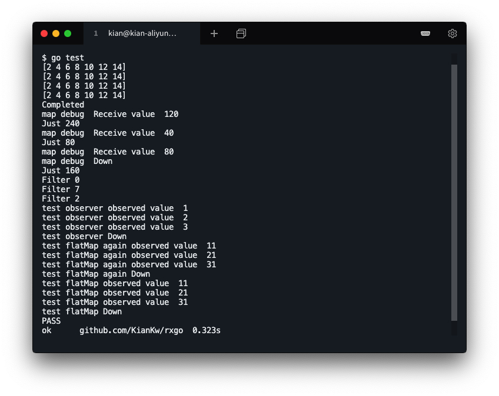
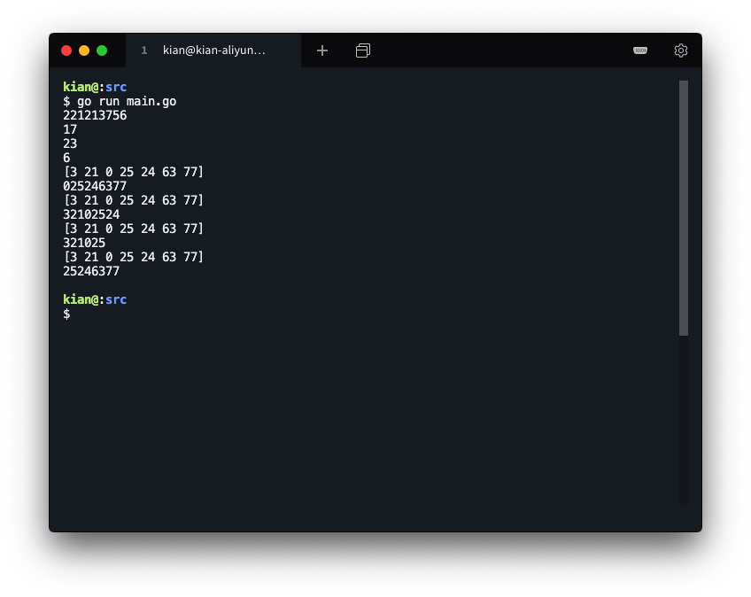

# 程序包开发 - 修改、改进 RxGo 包

### 环境说明

操作系统：`Ubuntu 18.04.4 LTS (GNU/Linux 4.15.0-96-generic x86_64)`

编译工具：`go version go1.10.4 linux/amd64` 


## 课程任务

阅读 ReactiveX 文档。请在 [pmlpml/RxGo](https://github.com/pmlpml/rxgo) 基础上，

1. 修改、改进它的实现
2. 或添加一组新的操作，如 [filtering](http://reactivex.io/documentation/operators.html#filtering)

该库的基本组成：

`rxgo.go` 给出了基础类型、抽象定义、框架实现、Debug工具等

`generators.go` 给出了 sourceOperater 的通用实现和具体函数实现

`transforms.go` 给出了 transOperater 的通用实现和具体函数实现


## 任务实现

> 选择「添加一组新的操作 - [filtering](http://reactivex.io/documentation/operators.html#filtering)」

Filtering 文档中的其他操作包括

* Debounce
* Distinct
* ElementAt
* First
* Last
* Sample
* Skip
* SkipLast
* Take
* TakeLast

### 代码实现

#### Observable

* 改进 rxgo.go 中的 Observable 结构体，添加以下 Filtering Operator 需要的数据，

    ```go
    only_first		  bool
    only_last		  bool
    debounce_timespan time.Duration
    only_distinct	  bool
    sample_interval   time.Duration
    element_at		  int
    skip			  int
    take			  int
    is_taking		  bool
    ```

#### opFunc

* 模仿 transforms.go 中的定义

    ```go
    type filteringOperator struct {
    	opFunc func(ctx context.Context, o *Observable, item reflect.Value, out chan interface{}) (end bool)
    }
    ```

#### op

* 模仿 transforms.go 中的 op

* out_buf 作为缓存来实现存储记忆

* rxgo.go 中的 Subcribe 函数会调用 op 函数

    ```go
    func (tsop filteringOperator) op(ctx context.Context, o *Observable) {
    	in := o.pred.outflow
        out := o.outflow
        interval := o.debounce_timespan
        var wg sync.WaitGroup
        var out_buf []interface{}
    	go func() {
    		is_appear := make(map[interface{}]bool)
    		end := false
    		start := time.Now()
    		sample_start := time.Now()
    		for x := range in {
    			// ...
    		}
    		// ...
    		wg.Wait()
    		if (o.only_last || o.only_first) && len(out_buf) == 0 && !o.flip_accept_error  {
    			o.sendToFlow(ctx, ErrInput, out)
    		}
    		o.closeFlow(out)
    	}()
    }
    ```

#### newFilterObservable

* 模仿 transforms.go 中的 newFilterObservable

    ```go
    func (parent *Observable) newFilterObservable(name string) (o *Observable) {
        o = newObservable()
        o.Name = name
        o.root = parent.root
        o.pred = parent
        parent.next = o
        o.buf_len = BufferLen
        o.only_first = false
        o.only_last = false
        o.debounce_timespan = 0
        o.only_distinct = false
        o.skip = 0
        o.take = 0
        return
    }
    ```

#### Debounce

* 作用

    * 消除抖动，过滤掉发射速率过快的数据项，实现数据的延迟发送。
    * 只有在过了一段指定的时间后，还没发射数据时，才发射一个数据
    * 记录时间差，每接受一个对象，就要计算距离上一次接受对象的时间差，只有当大于固定周期时，才接受数据项，并重置时间差。

* 测试函数

    ```go
    func TestDebounce(t *testing.T) {
    	res := []int{}
    	ob := Just(100, 200, 300, 400).Map(func(x int) int {
    		time.Sleep(20 * time.Millisecond)
    		return 2 * x
    	}).Debounce(30 * time.Millisecond)
    	ob.Subscribe(func(x int) {
    		res = append(res, x)
    	})
    	assert.Equal(t, []int{}, res, "Debounce Test Error!")
    }
    ```

* 实现函数

    ```go
    func (parent *Observable) Debounce(t time.Duration) (o *Observable) {
    	o = parent.newFilterObservable("Debounce")
    	o.debounce_timespan = t
    	o.operator = filteringOperator {
    		opFunc: func(ctx context.Context, o *Observable, x reflect.Value, out chan interface{}) (end bool) {
    			var params = []reflect.Value{x}
    			x = params[0]
    			if !end {
    				end = o.sendToFlow(ctx, x.Interface(), out)
    			}
    			return
    		},
    	}
    	return o
    }
    func (tsop filteringOperator) op(ctx context.Context, o *Observable) {
    	// ...
        if interval > time.Duration(0) && rt < interval {
            continue
        }
        if interval > time.Duration(0){
            if len(out_buf) > 2 {
                xv = reflect.ValueOf(out_buf[len(out_buf) - 2])
            }
        }
        // ...
    }
    ```

#### Distinct

* 作用

    * 将重复的数据项过滤掉，只允许还没有发射过的数据项通过。
    * 用 map来记录已经出现过的item，当在 map 中找不到数据项对应的记录的时候，我们就将该数据发射，并在 map 中留下记录。

* 测试函数

    ```go
    func TestDistinct(t *testing.T) {
    	res := []int{}
    	ob := Just(1, 2, 3, 4, 1, 2, 3, 4).Map(func(x int) int {
    		return 2 * x
    	}).Distinct()
    	ob.Subscribe(func(x int) {
    		res = append(res, x)
    	})
    	assert.Equal(t, []int{2, 4, 6, 8}, res, "Distinct Test Error!")
    }
    ```

* 实现函数

    ```go
    func (parent *Observable) Distinct() (o *Observable) {
    	o = parent.newFilterObservable("Distinct")
    	o.only_distinct = true
    	o.operator = filteringOperator {
    		opFunc: func(ctx context.Context, o *Observable, x reflect.Value, out chan interface{}) (end bool) {
    			var params = []reflect.Value{x}
    			x = params[0]
    			if !end {
    				end = o.sendToFlow(ctx, x.Interface(), out)
    			}
    			return
    		},
    	}
    	return o
    }
    func (tsop filteringOperator) op(ctx context.Context, o *Observable) {
    	// ...
        is_appear := make(map[interface{}]bool)
        for x := range in {
            if o.only_distinct && is_appear[xv.Interface()] {
                continue
            }
            o.mu.Lock()
            is_appear[xv.Interface()] = true
            o.mu.Unlock()    
        }
        // ...
    }
    ```

#### ElementAt

* 作用

    * 发送对应第n项的数据
    * 将输入流缓存在 out_buf 后，根据用户传入的索引找到该数据项

* 测试函数

    ```go
    func TestElementAt(t *testing.T) {
    	res := []int{}
    	ob := Just(1, 2, 3, 4, 5, 6, 7).Map(func(x int) int {
    		return 2 * x
    	}).ElementAt(4)
    	ob.Subscribe(func(x int) {
    		res = append(res, x)
    	})
    	assert.Equal(t, []int{8}, res, "ElementAt Test Error!")
    }
    
    ```

* 实现函数

    ```go
    func (parent *Observable) ElementAt(id int) (o *Observable) {
    	o = parent.newFilterObservable("ElementAt.n")
    	o.element_at = id
    	o.operator = filteringOperator {
    		opFunc: func(ctx context.Context, o *Observable, x reflect.Value, out chan interface{}) (end bool) {
    			var params = []reflect.Value{x}
    			x = params[0]
    			if !end {
    				end = o.sendToFlow(ctx, x.Interface(), out)
    			}
    			return
    		},
    	}
    	return
    }
    func (tsop filteringOperator) op(ctx context.Context, o *Observable) {
    	// ...
        if o.element_at != 0 {
            if o.element_at < 0 || o.element_at > len(out_buf) {
                o.sendToFlow(ctx, ElementOutOfBounds, out)
            } else {
                xv := reflect.ValueOf(out_buf[o.element_at-1])
                tsop.opFunc(ctx, o, xv, out)
            }
        }
        // ...
    }
    ```

#### First

* 作用

    * 只发射第一项数据。
    * 在发射第一个数据项后，将输出流阻塞。

* 测试函数

    ```go
    func TestFirst(t *testing.T) {
    	res := []int{}
    	ob := Just(1, 2, 3).Map(func(x int) int {
    		return 2 * x
    	}).First()
    	ob.Subscribe(func(x int) {
    		res = append(res, x)
    	})
    	assert.Equal(t, []int{2}, res, "First Test Error!")
    }
    ```

* 实现函数

    ```go
    func (parent *Observable) First() (o *Observable) {
    	o = parent.newFilterObservable("First")
    	o.only_first = true
    	o.operator = filteringOperator {
    		opFunc: func(ctx context.Context, o *Observable, x reflect.Value, out chan interface{}) (end bool) {
    			var params = []reflect.Value{x}
    			x = params[0]
    			if !end {
    				end = o.sendToFlow(ctx, x.Interface(), out)
    			}
    			return
    		},
    	}
    	return o
    }
    func (tsop filteringOperator) op(ctx context.Context, o *Observable) {
    	// ...
        if o.only_first {
            break
        }
        // ...
    }
    ```

#### Last

* 作用

    * 只发射最后一项数据
    * 将输入的数据项保存在 out_buf 中，选取最后一项放入输出流中。

* 测试函数

    ```go
    func TestLast(t *testing.T) {
    	res := []int{}
    	ob := Just(10, 20, 30).Map(func(x int) int {
    		return 2 * x
    	}).Last()
    	ob.Subscribe(func(x int) {
    		res = append(res, x)
    	})
    
    	assert.Equal(t, []int{60}, res, "Last Test Error!")
    }
    ```

* 实现函数

    ```go
    func (parent *Observable) Last() (o *Observable) {
    	o = parent.newFilterObservable("Last")
    	o.only_last  = true
    	o.operator = filteringOperator {
    		opFunc: func(ctx context.Context, o *Observable, x reflect.Value, out chan interface{}) (end bool) {
    			var params = []reflect.Value{x}
    			x = params[0]
    			if !end {
    				end = o.sendToFlow(ctx, x.Interface(), out)
    			}
    			return
    		},
    	}
    	return o
    }
    func (tsop filteringOperator) op(ctx context.Context, o *Observable) {
    	// ...
        if o.only_last && len(out_buf) > 0 {
            wg.Add(1)
            go func() {
                defer wg.Done()
                xv := reflect.ValueOf(out_buf[len(out_buf)-1])
                tsop.opFunc(ctx, o, xv, out)
            }()
        }
        // ...
    }
    ```

#### Sample

* 作用

    * 定期发射Observable最近发射的数据项
    * 设置固定周期，需要判断输入的对象属于哪个周期，如果是某个周期的第一个数据项，则发射该数据项，并更新周期。

* 测试函数

    ```go
    func TestSample(t *testing.T) {
    	res := []int{}
    	Just(1, 2, 3, 4, 3, 1, 2, 4, 3).Map(func(x int) int {
    		time.Sleep(20 * time.Millisecond)
    		return 2 * x
    	}).Sample(15 * time.Millisecond).Subscribe(func(x int) {
    		res = append(res, x)
    	})
    	assert.Equal(t, []int{2, 4, 6, 8, 6, 2, 4, 8, 6}, res, "Sample Test Error!")
    }
    ```

* 实现函数

    ```go
    func (parent *Observable) Sample(timespan time.Duration) (o *Observable) {
    	o = parent.newFilterObservable("Sample")
    	o.sample_interval = timespan
    	o.element_at = 0
    	o.operator = filteringOperator {
    		opFunc: func(ctx context.Context, o *Observable, x reflect.Value, out chan interface{}) (end bool) {
    			var params = []reflect.Value{x}
    			x = params[0]
    			if !end {
    				end = o.sendToFlow(ctx, x.Interface(), out)
    			}
    			return
    		},
    	}
    	return o
    }
    func (tsop filteringOperator) op(ctx context.Context, o *Observable) {
    	// ...
        if o.sample_interval > 0 && st < o.sample_interval {
            continue
        }
        if o.sample_interval > 0 {
            sample_start = sample_start.Add(o.sample_interval)
        }
        // ...
    }
    ```

#### Skip

* 作用

    * Skip 跳过前 n 个数据项，将后续的数据项发射
    * 将输入的数据项保存在 out_buf 中，跳过前 n 项后，将其他数据项放入输出流里。

* 测试函数

    ```go
    func TestSkip(t *testing.T) {
    	res := []int{}
    	ob := Just(1, 2, 3, 4, 5, 6, 7).Map(func(x int) int {
    		return 2 * x
    	}).Skip(4)
    	ob.Subscribe(func(x int) {
    		res = append(res, x)
    	})
    	assert.Equal(t, []int{10, 12, 14}, res, "Skip Test Error!")
    }
    ```

* 实现函数

    ```go
    func (parent *Observable) Skip(num int) (o *Observable) {
    	o = parent.newFilterObservable("Skip.n")
    	o.skip = num
    	o.operator = filteringOperator {
    		opFunc: func(ctx context.Context, o *Observable, x reflect.Value, out chan interface{}) (end bool) {
    			var params = []reflect.Value{x}
    			x = params[0]
    			if !end {
    				end = o.sendToFlow(ctx, x.Interface(), out)
    			}
    			return
    		},
    	}
    	return o
    }
    func judgeMode(isTake bool, division int, in []interface{}) ([]interface{}, error) {
    	fmt.Println(in)
    	if (isTake && division > 0) || (!isTake && division < 0) {
    		if !isTake {
    			division = len(in) + division
    		}
    		if division >= len(in) || division <= 0{
    			return nil, ErrIndex
    		}
    		return in[:division], nil
    	}
    	// ...
    	return nil, ErrIndex
    }
    ```

#### SkipLast

* 作用

    * SkipLast 跳过最后 n 个数据项，将其它数据项发射
    * 将输入的数据项保存在 out_buf 中，略过后 n 项后，将其他数据项放入输出流里。

* 测试函数

    ```go
    func TestSkipLast(t *testing.T) {
    	res := []int{}
    	ob := Just(1, 2, 3, 4, 5, 6, 7).Map(func(x int) int {
    		return 2 * x
    	}).SkipLast(4)
    	ob.Subscribe(func(x int) {
    		res = append(res, x)
    	})
    	assert.Equal(t, []int{2, 4, 6}, res, "SkipLast Test Error!")
    }
    ```

* 实现函数

    ```go
    func (parent *Observable) SkipLast(num int) (o *Observable) {
    	o = parent.newFilterObservable("SkipLast.n")
    	o.skip = -num
    	o.operator = filteringOperator {
    		opFunc: func(ctx context.Context, o *Observable, x reflect.Value, out chan interface{}) (end bool) {
    			var params = []reflect.Value{x}
    			x = params[0]
    			if !end {
    				end = o.sendToFlow(ctx, x.Interface(), out)
    			}
    			return
    		},
    	}
    	return o
    }
    func judgeMode(isTake bool, division int, in []interface{}) ([]interface{}, error) {
    	fmt.Println(in)
    	if (isTake && division > 0) || (!isTake && division < 0) {
    		if !isTake {
    			division = len(in) + division
    		}
    		if division >= len(in) || division <= 0{
    			return nil, ErrIndex
    		}
    		return in[:division], nil
    	}
    	// ...
    	return nil, ErrIndex
    }
    ```

#### Take

* 作用

    * 将前 n 个数据项发射，丢弃其他数据项
    * 将输入的数据项保存在 out_buf 中，选取前 n 项放入输出流里。

* 测试函数

    ```go
    func TestTake(t *testing.T) {
    	res := []int{}
    	ob := Just(1, 2, 3, 4, 5, 6, 7).Map(func(x int) int {
    		return 2 * x
    	}).Take(4)
    	ob.Subscribe(func(x int) {
    		res = append(res, x)
    	})
    	assert.Equal(t, []int{2, 4, 6, 8}, res, "Take Test Error!")
    }
    ```

* 实现函数

    ```go
    func (parent *Observable) Take(num int) (o *Observable) {
    	o = parent.newFilterObservable("Take")
    	o.take = num
    	o.is_taking = true
    	o.operator = filteringOperator {
    		opFunc: func(ctx context.Context, o *Observable, x reflect.Value, out chan interface{}) (end bool) {
    			var params = []reflect.Value{x}
    			x = params[0]
    			if !end {
    				end = o.sendToFlow(ctx, x.Interface(), out)
    			}
    			return
    		},
    	}
    	return o
    }
    func judgeMode(isTake bool, division int, in []interface{}) ([]interface{}, error) {
    	// ...
    	if (isTake && division < 0) || (!isTake && division > 0) {
    		if isTake {
    			division = len(in) + division
    		}
    		if division >= len(in) || division <= 0{
    			return nil, ErrIndex
    		}
    		return in[division:], nil
    	}
    	return nil, ErrIndex
    }
    ```

#### TakeLast

* 作用

    * 发射最后 n 个数据项，将丢弃其他数据项
    * 将输入的数据项保存在 out_buf 中，选取后 n 项放入输出流里。

* 测试函数

    ```go
    func TestTakeLast(t *testing.T) {
    	res := []int{}
    	ob := Just(1, 2, 3, 4, 5, 6, 7).Map(func(x int) int {
    		return 2 * x
    	}).TakeLast(4)
    	ob.Subscribe(func(x int) {
    		res = append(res, x)
    	})
    	assert.Equal(t, []int{8, 10, 12, 14}, res, "TakeLast Test Error!")
    }
    ```

* 实现函数

    ```go
    func (parent *Observable) TakeLast(num int) (o *Observable) {
    	o = parent.newFilterObservable("TakeLast")
    	o.take = -num
    	o.is_taking = true
    	o.operator = filteringOperator {
    		opFunc: func(ctx context.Context, o *Observable, x reflect.Value, out chan interface{}) (end bool) {
    			var params = []reflect.Value{x}
    			x = params[0]
    			if !end {
    				end = o.sendToFlow(ctx, x.Interface(), out)
    			}
    			return
    		},
    	}
    	return o
    }
    func judgeMode(isTake bool, division int, in []interface{}) ([]interface{}, error) {
    	// ...
    	if (isTake && division < 0) || (!isTake && division > 0) {
    		if isTake {
    			division = len(in) + division
    		}
    		if division >= len(in) || division <= 0{
    			return nil, ErrIndex
    		}
    		return in[division:], nil
    	}
    	return nil, ErrIndex
    }
    ```

### 测试

#### 单元测试




#### 功能测试

编写测试文件

```go
package main

import (
	"fmt"
	"time"

	RxGo "github.com/KianKw/rxgo"
)

func main() {
	RxGo.Just(22, 12, 12, 13, 7, 5, 6, 22).Distinct().Subscribe(func(x int) {
		fmt.Print(x)
	})
	fmt.Println()

	RxGo.Just(2, 1, 12, 13, 17, 5, 6, 22).ElementAt(5).Subscribe(func(x int) {
		fmt.Print(x)
	})
	fmt.Println()

	RxGo.Just(23, 11, 2, 3, 1, 25, 66).First().Subscribe(func(x int) {
		fmt.Print(x)
	})
	fmt.Println()

	RxGo.Just(33, 1, 0, 215, 4, 6).Last().Subscribe(func(x int) {
		fmt.Print(x)
	})
	fmt.Println()

	RxGo.Just(3, 21, 0, 25, 24, 63, 77).Skip(2).Subscribe(func(x int) {
		fmt.Print(x)
	})
	fmt.Println()

	RxGo.Just(3, 21, 0, 25, 24, 63, 77).SkipLast(2).Subscribe(func(x int) {
		fmt.Print(x)
	})
	fmt.Println()

	RxGo.Just(3, 21, 0, 25, 24, 63, 77).Take(4).Subscribe(func(x int) {
		fmt.Print(x)
	})
	fmt.Println()
	
	RxGo.Just(3, 21, 0, 25, 24, 63, 77).TakeLast(4).Subscribe(func(x int) {
		fmt.Print(x)
	})
	fmt.Println()

	observableP := make(chan interface{})
	go func() {
		RxGo.Just(1, 2, 3, 4, 5).Map(func(x int) int {
			switch x {
			case 1:
				time.Sleep(3 * time.Millisecond)
			case 2:
				time.Sleep(1 * time.Millisecond)
			case 3:
				time.Sleep(2 * time.Millisecond)
			case 4:
				time.Sleep(2 * time.Millisecond)
			default:
				time.Sleep(1 * time.Millisecond)
			}
			return x
		}).Subscribe(func(x int) {
			observableP <- x
		})
	}()
	fmt.Println()
}
```

运行测试

