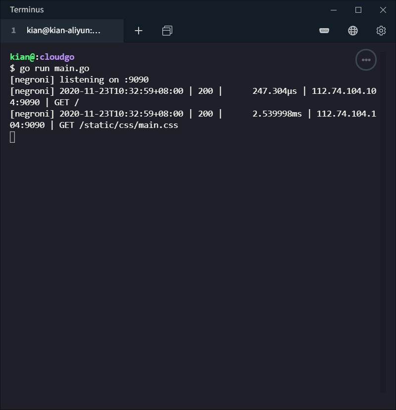

# 开发 web 服务程序

### 环境说明

操作系统：(阿里云) `Ubuntu 18.04.4 LTS (GNU/Linux 4.15.0-96-generic x86_64)`

编译工具：`go version go1.10.4 linux/amd64` 

## 实验要求

1. 编程 web 服务程序 类似 cloudgo 应用
    - 支持静态文件服务
    - 支持简单 js 访问
    - 提交表单，并输出一个表格（必须使用模板）
2. 使用 curl 测试，将测试结果写入 README.md
3. 使用 ab 测试，将测试结果写入 README.md。并解释重要参数

## 实验过程

### 包源码阅读

源码阅读体会发布在 CSDN 上：传送门 [CSDN](https://blog.csdn.net/KianKwok/article/details/110003395)

### 开发简单的 Web 服务

(注：因为我的开发环境配置在云服务器上，所以测试均使用 IP 地址，读者自己运行时将 IP 改为 localhost 即可)

```shell
http://localhost:9090
```




### 代码分析

#### 静态文件服务功能

* 对应代码

    ```go
    mx.PathPrefix("/static").Handler(http.StripPrefix("/static/", http.FileServer(http.Dir(webRoot+"/templates/"))))
    ```

* 获取 css 文件

    ```shell
    http://localhost:9090/static/css/main.css
    ```

    

    

* 获取图片文件

    ```shell
    http://localhost:9090/static/sysu-logo.jpg
    ```

    

* 查看服务器端

    

#### 简单 js 访问功能

* `"github.com/unrolled/render"` 包中的 json 函数

    对应代码

    ```go
    return func(w http.ResponseWriter, req *http.Request) {
        formatter.JSON(w, http.StatusOK, user)
    }
    ```

    在**输入信息并提交**后，用户名和密码便可以以 json 的格式输出，如果没有提交，默认输出为空。

    ```shell
    http://localhost:9090/json
    ```

    

* 读取 JavaScript 文件

    

    

#### 使用模板完成提交表单输出表格功能

* 对应代码

    ```go
    func submitPorcess(w http.ResponseWriter, r *http.Request) {
    	r.ParseForm()
    	fmt.Println(r.Form)
    	user.Username = r.Form["username"][0]
    	user.Password = r.Form["password"][0]
    	if len(user.Username) == 0 || len(user.Password) == 0 {
    		log.Fatal("err")
    		return
    	}
    	t := template.Must(template.ParseFiles("templates/table.html"))
    	data := map[string]string{
    		"Username": user.Username,
    		"Password": user.Password,
    	}
    	if err := t.Execute(w, data); err != nil {
    		log.Fatal(err)
    	}
    }
    ```

* 输入信息

    ```shell
    http://localhost:9090
    ```

    

* 提交后显示表单

    

    


### curl 测试

```shell
curl -v http://localhost:9090
```


```shell
curl -v http://localhost:9090/static/css/main.css
```


```shell
curl -v http://localhost:9090/static/js/hello.js
```


```shell
curl -v http://localhost:9090/json
```


### ab 测试

ab 命令

* 用来进行压力测试
* 参数  -n 表示请求数
* 参数 -c 表示并发数

输出参数解释

* Concurrency Level：并发数
* Time taken for tests：完成所有请求总共花费的时间
* Complete requests：成功请求的次数
* Failed requests：失败请求的次数
* Total transferred：总共传输的字节数
* HTML transferred：实际页面传输的字节数
* Requests per second：每秒请求数
* Time per request: [ms] (mean)： 平均每个用户等待的时间
* Time per request: [ms] (mean, across all concurrent requests) ：服务器处理的平均时间
* Transfer rate：传输速率

```shell
ab -n 10000 http://localhost:9090/
```


```shell
ab -n 1000 -c 1000 http://localhost:9090/
```


```shell
ab -n 1000 -c 100 http://localhost:9090/static/css/main.css
```


### 拓展部分

源码阅读体会发布在 CSDN 上：传送门 [CSDN](https://blog.csdn.net/KianKwok/article/details/110003395)