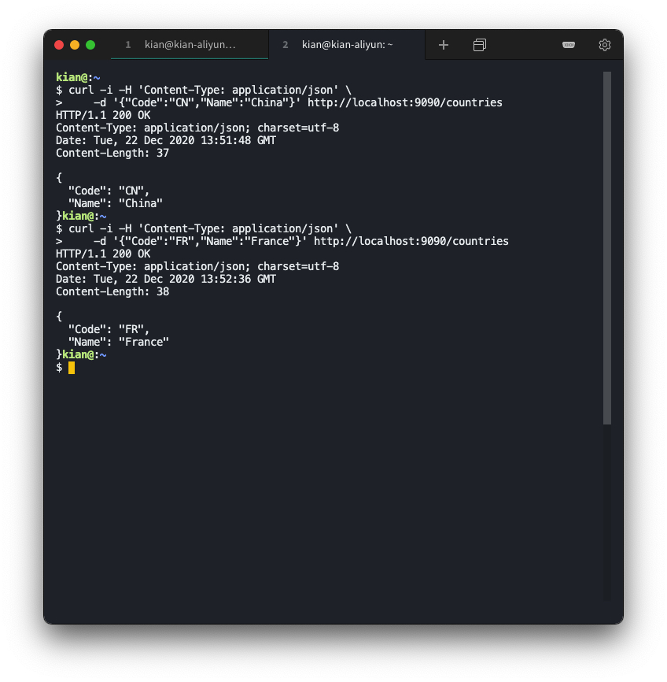
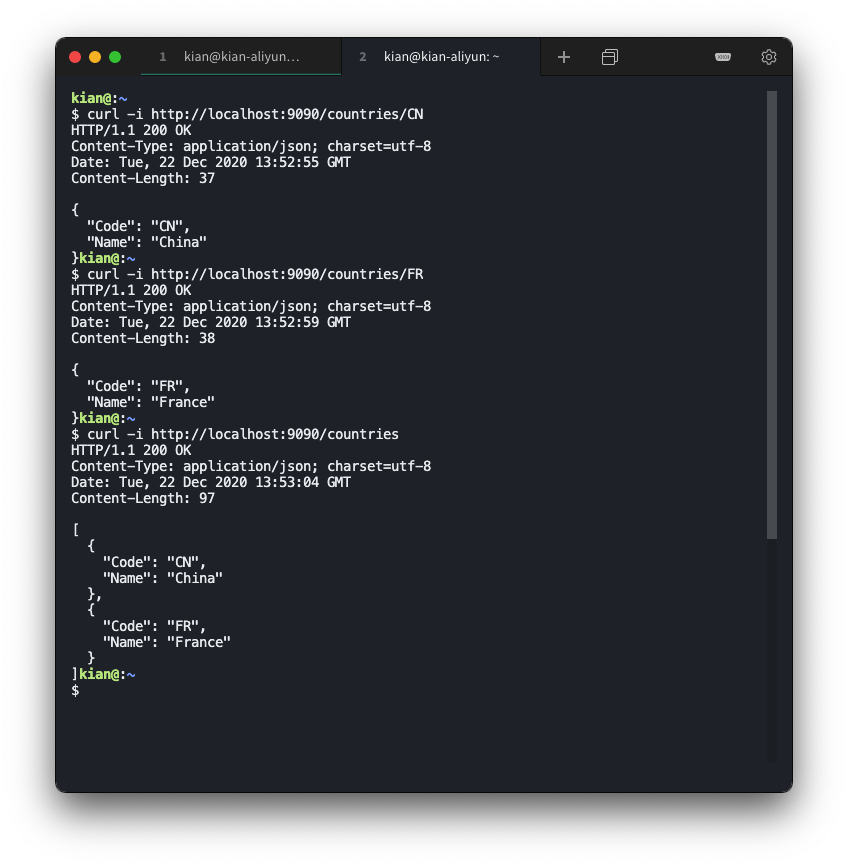
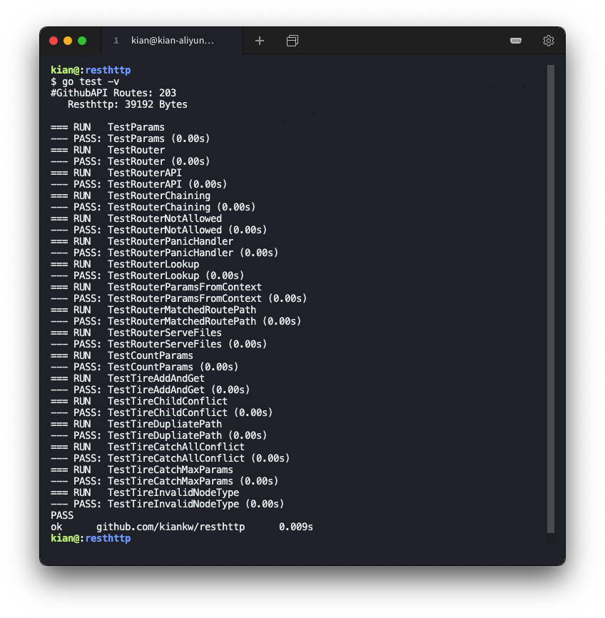
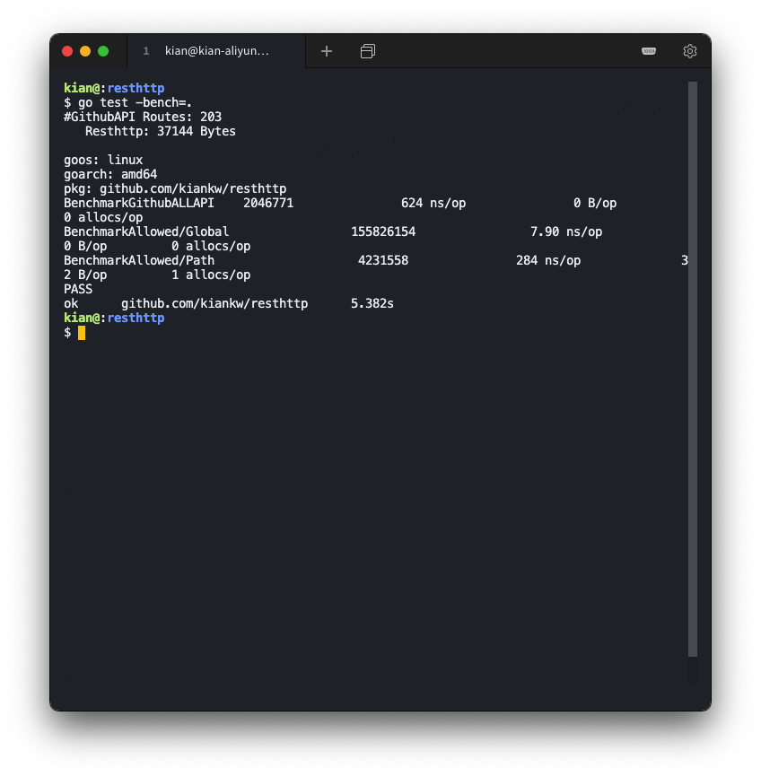

# 设计一个专用于REST API高性能路由库

### 环境说明

（阿里云服务器）

操作系统：`Ubuntu 18.04.4 LTS (GNU/Linux 4.15.0-96-generic x86_64)`

编译工具：`go version go1.10.4 linux/amd64` 

## 实验要求

设计一个专用于 REST API 高性能路由库

- 使用 [Go HTTP Router Benchmark](https://github.com/julienschmidt/go-http-routing-benchmark) 测试性能
- 尽量满足 GitHub 的所有 API


## 实验过程

### REST 介绍

REST 的核心原则是定义一些可以被少量方法操作的资源，将资源名称映射到 URLs 上，方法映射到 HTTP 的 POST、GET、PUT、 DELETE 四种方法上。

设计规范

* 动词 + 宾语

    客户端发出的数据操作指令都是「动词 + 宾语」的结构。比如，`GET /users`这个命令，`GET`是动词，`/users`是宾语。

* 动词的覆盖

    动词通常就是四种 HTTP 方法，对应 CRUD 操作。GET 表示读取（Read），POST表示新建（Create），PUT 表示更新（Update），DELETE 表示删除（Delete）。

* 宾语必须是名词

    API 的 URL  必须是名词，代表资源。

* 复数 URL

    URL 中的名词尽量都使用复数。

* 避免多级 URL

    除了第一级外，其他级别都尽量使用查询字符串表达。

* 状态码必须精准

    `1xx` 表示相关信息；`2xx` 表示操作成功；`3xx` 表示重定向；`4xx` 表示客户端错误；`5xx` 表示服务器错误。

### 编写代码

router.go

* struct API

```go
type Api struct {
	router *Router
}
```

* 添加路由，传入不定参数，根据参数的 方法来判断添加路由的种类。

```go
func (api *Api) SetRouter(middlewares ...*Middleware) {
	for _, middleware := range middlewares {
		switch middleware.method {
		case "GET":
			api.GET(middleware.path, middleware.handle)
		case "POST":
			api.POST(middleware.path, middleware.handle)
		case "PUT":
			api.PUT(middleware.path, middleware.handle)
		case "DELETE":
			api.DELETE(middleware.path, middleware.handle)
		}
	}
}
```

* struct Router

```go
type Router struct {
	tires          map[string]*node
	pPools         sync.Pool
	maxParams      uint16
	errorHandle    func(http.ResponseWriter, *http.Request, interface{})
}
```

* 函数 cleanPath 处理输入的路径。传入一个路径参数，输出一个规范的路径。该函数会清除重复的 `/` `.`等符号。

```go
func cleanPath(p string) string {
	// ...
	index := strings.Index(p, "//")
	if index == -1 {
		_, err := b.WriteString(p)
		if err != nil {
			panic(err)
		}
		return b.String()
	}
	// ...
	for i := index + 2; i < len(p); i++ {
		if p[i] == '/' {
			if slash {
				continue
			}
			slash = true
		} else {
			slash = false
		}
		b.Write([]byte{p[i]})
	}
	return b.String()
}
```

* 函数 Handle：传入的路径和方法参数，新建一个的请求 handle

```go
func (r *Router) Handle(method, path string, handle Handle) {
	varsCount := uint16(0)
	if r.tires == nil {
		r.tires = make(map[string]*node)
	}
	root := r.tires[method]
	if root == nil {
		root = new(node)
		r.tires[method] = root

		r.globalAllowed = r.allowed("*", "")
	}
	root.addRoute(path, handle)
}
```

* 函数 Handler：适配 net/http 的 Handler 函数

```go
func (r *Router) Handler(method, path string, handler http.Handler) {
	r.Handle(method, path,
		func(w http.ResponseWriter, req *http.Request, p Params) {
			if len(p) > 0 {
				ctx := req.Context()
				ctx = context.WithValue(ctx, ParamsKey, p)
				req = req.WithContext(ctx)
			}
			handler.ServeHTTP(w, req)
		},
	)
}
```

* 函数 HandlerFunc：适配 net/http 的 HandlerFunc 函数

```go
func (r *Router) HandlerFunc(method, path string, handler http.HandlerFunc) {
	r.Handler(method, path, handler)
}
```

* 函数 LookUp 查询方法和路径，如果找到路径返回 handle 函数和路径参数值；如果找不到，重定向到不带末尾斜杠的相同路径。

```go
func (r *Router) Lookup(method, path string) (Handle, Params, bool) {
	if root := r.tires[method]; root != nil {
		handle, ps, tsr := root.getValue(path, r.getParams)
		if handle == nil {
			r.putParams(ps)
			return nil, nil, tsr
		}
		if ps == nil {
			return handle, nil, tsr
		}
		return handle, *ps, tsr
	}
	return nil, nil, false
}
```

* 函数 ServeHTTP 使路由器实现 http.Handler 的接口.

```go
func (router *Router) ServeHTTP(w http.ResponseWriter, request *http.Request) {
	if router.errorHandle != nil {
		defer router.myRecover(w, request)
	}

	reqPath := request.URL.Path

	if root := router.tires[request.Method]; root != nil {
		// ...
        if tsr && router.RedirectTrailingSlash {
            if len(reqPath) > 1 && reqPath[len(reqPath)-1] == '/' {
                request.URL.Path = reqPath[:len(reqPath)-1]
            } else {
                request.URL.Path = reqPath + "/"
            }
            http.Redirect(w, request, request.URL.String(), code)
            return
        }
	}

	if router.isAllowMethod { // Handle 405
		if allow := router.allowed(reqPath, request.Method); allow != "" {
			w.Header().Set("Allow", allow)
			if router.MethodNotAllowed != nil {
				router.MethodNotAllowed.ServeHTTP(w, request)
			} else {
				http.Error(w,
					http.StatusText(http.StatusMethodNotAllowed),
					http.StatusMethodNotAllowed,
				)
			}
			return
		}
	}

	// Handle 404
	if router.NotFound != nil {
		router.NotFound.ServeHTTP(w, request)
	} else {
		http.NotFound(w, request)
	}
}
```

tire.go

* 设计字典树来存储 URL 信息，字典树的实现参考了 [go json rest](https://github.com/ant0ine/go-json-rest)  中字典树的设计。
* 字典树的插入算法思路：首先将当前节点赋值为根节点，按顺序遍历 URL 的每一个子串。判断该子串是否在当前节点的子节点中，如果该子串不在当前节点的子节点中，为当前节点插入新子节点。判断当前节点确定的那个子节点是否有结束标志，如果有，则说明该字符串的某个前缀已经存在于字典树中，插入失败。当前节点变换为确定的那个子节点。最终，循环结束，字符串插入完成，设置字符串结尾的结束标志。

```go

func (n *node) insertChild(path, fullPath string, handle Handle) {
	for {
		wildcard, i, valid := findWildcard(path)
		// ...
		if wildcard[0] == ':' {
			n.wildChild = true
			child := &node{
				nType: param,
				path:  wildcard,
			}
			n.children = []*node{child}
			n = child
			n.priority++
			// ...
			n.handle = handle
			return
		}
		//...
		child := &node{
			wildChild: true,
			nType:     catchAll,
		}
		n.children = []*node{child}
		n.indices = string('/')
		n = child
		n.priority++
		child = &node{
			path:     path[i:],
			nType:    catchAll,
			handle:   handle,
			priority: 1,
		}
		n.children = []*node{child}
		return
	}
	n.path = path
	n.handle = handle
}
```

github_test.go

* 利用 [go http routing benchmark](https://github.com/julienschmidt/go-http-routing-benchmark) 导入 GitHub API 以测试路由器的性能

```go
type route struct {
	method string
	path   string
}

var githubAPI = []route{
	{"GET", "/authorizations"},
	{"GET", "/authorizations/:id"},
    // ...
	{"GET", "/user/keys/:id"},
	{"POST", "/user/keys"},
	//{"PATCH", "/user/keys/:id"},
	{"DELETE", "/user/keys/:id"},
}
func loadResthttpSingle(method, path string, handle httprouter.Handle) http.Handler {
	router := httprouter.New()
	router.Handle(method, path, handle)
	return router
}

func benchRoutes(b *testing.B, router http.Handler, routes []route) {
	// w := new(mockResponseWriter)
	r, _ := http.NewRequest("GET", "/", nil)
	u := r.URL
	rq := u.RawQuery

	b.ReportAllocs()
	b.ResetTimer()

	for i := 0; i < b.N; i++ {
		for _, route := range routes {
			r.Method = route.method
			r.RequestURI = route.path
			u.Path = route.path
			u.RawQuery = rq
			// router.ServeHTTP(w, r)
		}
	}
}
```

### 运行用例

编写 main.go

```go
package main

import (
	"encoding/json"
	"fmt"
	"io/ioutil"
	"log"
	"net/http"
	"sync"

	"github.com/kiankw/resthttp"
)

func main() {

	api := resthttp.NewApi()

	api.SetRouter(
		resthttp.GET("/countries", GetAllCountries),
		resthttp.POST("/countries/", PostCountry),
		resthttp.GET("/countries/:code", GetCountry),
		resthttp.DELETE("/countries/:code", DeleteCountry),
	)
	log.Fatal(http.ListenAndServe(":9090", api.MakeHandler()))
}

type Country struct {
	Code string
	Name string
}

var store = map[string]*Country{}

var lock = sync.RWMutex{}

func GetCountry(w http.ResponseWriter, r *http.Request, ps resthttp.Params) {
	code := ps.ByName("code")

	lock.RLock()
	var country *Country
	if store[code] != nil {
		country = &Country{}
		*country = *store[code]
	}
	lock.RUnlock()

	countryjson, _ := json.Marshal(country)

	fmt.Fprint(w, string(countryjson))
}

func GetAllCountries(w http.ResponseWriter, r *http.Request, _ resthttp.Params) {
	lock.RLock()
	countries := make([]Country, len(store))
	i := 0
	for _, country := range store {
		countries[i] = *country
		i++
	}
	lock.RUnlock()

	countriesjson, _ := json.Marshal(countries)

	fmt.Fprint(w, string(countriesjson))
}

func PostCountry(w http.ResponseWriter, r *http.Request, _ resthttp.Params) {
	country := Country{}

	s, _ := ioutil.ReadAll(r.Body)
	json.Unmarshal(s, &country)
	lock.Lock()
	store[country.Code] = &country
	lock.Unlock()

	countryjson, _ := json.Marshal(country)

	fmt.Fprint(w, string(countryjson))
}

func DeleteCountry(w http.ResponseWriter, r *http.Request, ps resthttp.Params) {
	code := ps.ByName("code")
	lock.Lock()
	delete(store, code)
	lock.Unlock()
	fmt.Fprintf(w, string(http.StatusOK))
}

```

```shell
go run main.go
```

POST 操作

```shell
curl -i -H 'Content-Type: application/json' \
    -d '{"Code":"CN","Name":"China"}' http://localhost:9090/countries
curl -i -H 'Content-Type: application/json' \
    -d '{"Code":"FR","Name":"France"}' http://localhost:9090/countries
```



GET 操作

```shell
curl -i http://127.0.0.1:8080/countries/CN
curl -i http://127.0.0.1:8080/countries/FR
curl -i http://127.0.0.1:8080/countries
```



### 测试

单元测试



基准测试



