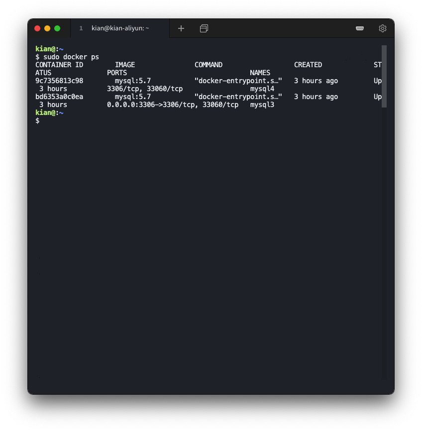
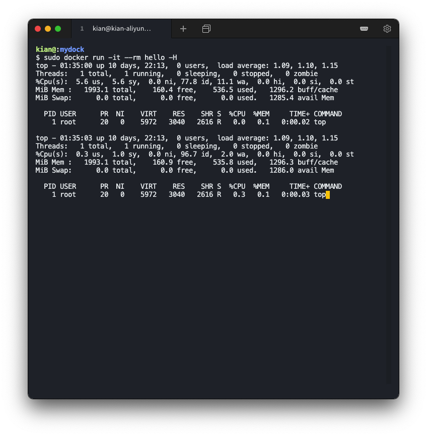
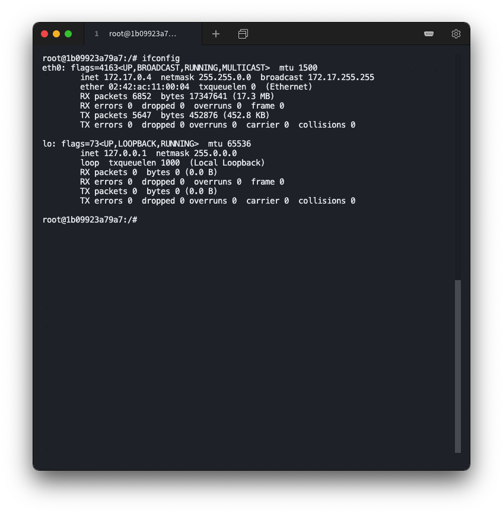

# 容器化技术与容器服务实践

> 18342021

### 环境说明

（阿里云服务器）

操作系统：`Ubuntu 18.04.4 LTS (GNU/Linux 4.15.0-96-generic x86_64)`

## 实验要求

按「容器化技术与容器服务」课件内容实践

## 实验过程

### Hello, world

准备 docker 环境

```shell
docker version
```


运行第一个容器

```shell
docker run hello-world
```


### Docker 基本操作

* 运行镜像

    ```shell
    docker run -it ubuntu bash
    ls
    exit
    ```

    

* 显示本地镜像库内容

    ```shell
    docker images
    ```

    

* 获取帮助

    ```shell
    docker --help
    ```

    

* 显示运行中容器

    ```shell
    docker ps
    ```

    

* 显示所有容器（包含已中止）

    ```shell
    docker ps -a
    ```
    
    

### MySQL 与容器化


拉取 MySQL 镜像

(拉取时间较长，请耐心等待 ... )

```shell
docker pull mysql:5.7
```


构建 docker 镜像练习

* 新建文件

    ```shell
    mkdir mydock && cd mydock
    vim dockerfile
    ```

    录入内容

    ```
    FROM ubuntu
    ENTRYPOINT ["top", "-b"]
    CMD ["-c"]
    ```

    

* 构建镜像

    ```shell
    docker build . -t hello
    ```

    

* 运行镜像

    ```shell
    docker run -it --rm hello -H
    ```

    


使用 MySQL 容器

* 启动服务器

    ```shell
    sudo docker run -p 3306:3306 --name mysql3 -e MYSQL_ROOT_PASSWORD=root -d mysql:5.7
    ```

    

    

* 启动 MySQL 客户端

    ```shell
    docker run -it --net host mysql:5.7 "sh"
    mysql -h127.0.0.1 -P3306 -uroot -proot
    ```

    

* mysql 客户端基本操作

* 数据库文件在哪里

    ```shell
    docker exec -it mysql3 bash
    ```

    

* Dockerfile 的 VOLUME /var/lib/mysql 的含义

    ```shell
    docker container prune -f
    docker volume prune
    docker volume ls
    ```

    


创建卷并挂载

```shell
docker rm $(docker ps -a -q) -f -v
docker volume create mydb
docker run --name mysql2 -e MYSQL_ROOT_PASSWORD=root -v mydb:/var/lib/mysql -d mysql:5.7
```


启动客户端容器链接服务器

```shell
docker run --name myclient --link mysql2:mysql -it mysql:5.7 bash
```


挂载现有数据库

```shell
docker run -v "$PWD/data":/var/lib/mysql --user 1000:1000 --name
some-mysql -e MYSQL_ROOT_PASSWORD=root -d mysql:5.7
```


修改容器配置

```shell
docker run --name some-mysql -v /my/custom:/etc/mysql/conf.d -e
MYSQL_ROOT_PASSWORD=my-secret-pw -d mysql:tag
```


Docker compose 与多容器应用自动化部署


### Docker 网络

管理容器网络

```shell
docker network ls
```


备制支持 ifconfig 和 ping 命令的 ubuntu 容器

```shell
docker run --name unet -it --rm ubuntu bash
apt-get update
apt-get install net-tools
```


```shell
apt-get install iputils-ping -y
```


```shell
ifconfig
```



```shell
ping [ip]
```


启动另一个命令窗口，由容器制作镜像

```shell
 docker commit unet ubuntu:net
```


创建自定义网络

```shell
docker network create mynet
```


在两个窗口创建 u1,u2 容器网络

* 创建 u1 容器网络

    ```shell
     docker run --name u1 -it -p 8080:80 --net mynet --rm ubuntu:net bash
    ```

    

    

* 创建 u2 容器网络

    ```shell
    docker run --name u2 --net mynet -it --rm ubuntu:net bash
    ```

    

    

* 测试命令

    ```shell 
    docker inspect u1
    ```

    

    ```shell
    docker network connect bridge u1
    docker network disconnect mynet u1
    ```

    


### 容器监控与与日志


检查docker的状态

```shell
docker info
```


```shell
docker info --format {{.ServerVersion}}
```


容器日志查看

```shell
docker logs [id]
```


```shell
docker logs --tail 2 [id]
```

